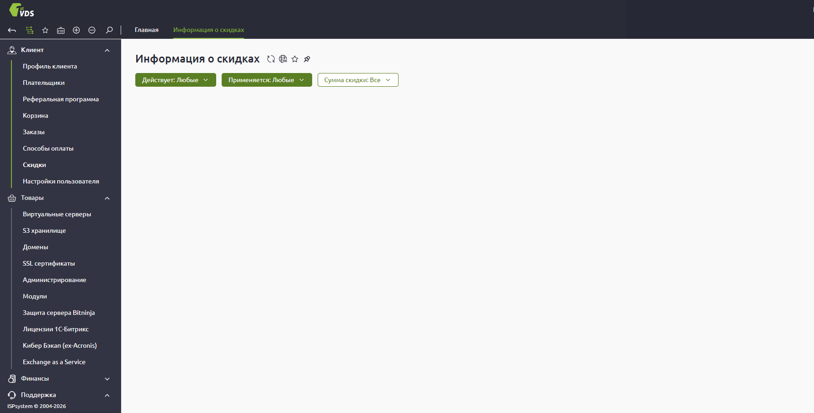
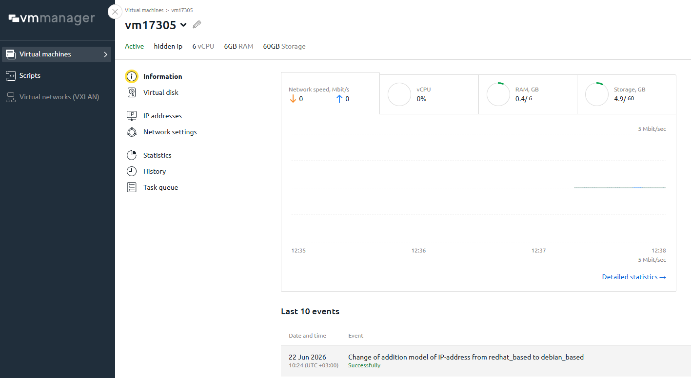

# FirstVDS

[FirstVDS](https://firstvds.ru/?from=1229224) - крупный VPS/VDS-провайдер с большим выбором серверов, локаций и дополнительных услуг. Его можно рассматривать для обычных VPS-задач, но кабинет и поиск нужных настроек требуют терпения.

## Кратко

FirstVDS выглядит как зрелый провайдер для виртуальных серверов: есть готовые тарифы, конструктор VDS, CPU.Турбо, Storage, GPU, Windows-серверы, S3, бэкапы, DNS, DDoS-защита, BitNinja и другие дополнительные услуги.

По официальному сайту у провайдера есть серверы в России, Нидерландах и Казахстане. На 22 июня 2026 года на главной странице указана стартовая цена VPS/VDS от 249 рублей в месяц, но перед покупкой нужно проверять актуальные тарифы и условия продления.

## Личный опыт

Главное впечатление - опций много, но найти нужную настройку в кабинете сложно. Сервис дает широкий набор возможностей, однако навигация перегружена: чтобы добраться до нужного действия, иногда приходится долго искать правильный раздел.

Отдельный минус - часть изменений нельзя спокойно сделать самостоятельно. Если нужно поменять почту, телефон или другие данные аккаунта, приходится писать в техподдержку.

После такого обращения могут дополнительно проверять владельца аккаунта через подтверждение телефонным звонком. Это повышает безопасность, но добавляет еще один ручной шаг к простым изменениям.

Консоль управления виртуальной машиной, если ее найти, по ощущению такая же, как у [HSHP](./hshp.md). Поэтому базовые действия с VM понятны, но путь до самой консоли не очевиден.

## Скриншоты

Личный кабинет FirstVDS перегружен разделами и вложенными пунктами. Нужные настройки есть, но их приходится искать по левому меню и отдельным вкладкам.

Консоль управления виртуальной машиной открывается в vmmanager и выглядит отдельно от основного кабинета FirstVDS.

## Пример обращения в поддержку

В обращении 22 июня 2026 года вопрос был про передачу сервера другому клиенту или передачу аккаунта через смену e-mail. Поддержка ответила, что сервер можно перенести между аккаунтами по запросам с обоих аккаунтов: в каждом запросе нужно указать сервер, исходный аккаунт и аккаунт получателя.

Для такого переноса требуется подтверждение звонком на проверенный номер телефона. Смена e-mail аккаунта тоже делается через поддержку и также подтверждается звонком. После изменения e-mail на новый адрес отправляют письмо для подтверждения.

При попытке изменить имя аккаунта, контактное лицо и данные плательщика поддержка попросила указать полные ФИО или полное название компании. Это стоит учитывать заранее: короткое имя или псевдоним для таких данных не подходит. При этом правило выглядит непоследовательно: если в аккаунте уже было указано просто имя, заменить его на другое короткое имя все равно не дают без полного ФИО или полного названия юрлица. И тут тоже обзванивает сотрудник и уточняет, для подтверждения.

## Реферальная ссылка

Реферальная ссылка для регистрации: [firstvds.ru](https://firstvds.ru/?from=1229224).

## Публичные отзывы

Проверка публичных отзывов 22 июня 2026 года дает смешанную, но в целом рабочую картину.

Что повторяется в положительных отзывах:

- долгий срок использования, иногда 10-14 лет;
- стабильная работа VPS и редкие простои;
- нормальное соотношение цены и качества;
- большой выбор конфигураций и возможность менять тарифы;
- понятная панель управления после привыкания;
- быстрые ответы поддержки в свежих положительных отзывах;
- удобство для сайтов, небольших сервисов, пет-проектов и серверов с ручным администрированием.

Что повторяется в отрицательных и осторожных отзывах:

- жалобы на нестабильность, короткие простои и просадки производительности;
- претензии к медленной или платной поддержке;
- жалобы на перегрузки, оверселлинг и тормоза на отдельных VPS;
- случаи блокировки или фильтрации сервера при подозрении на DDoS или высокую нагрузку;
- жалобы на то, что часть вопросов поддержки переводится в платные услуги;
- вопросы к почте, DNS, бэкапам и отдельным старым тарифам.

Важная поправка: FirstVDS сам собирает отзывы через свою форму и предлагает клиентам скидку до 25% на месяц обслуживания за опубликованный отзыв на сторонней площадке. Это не делает все отзывы недостоверными, но объясняет, почему позитивных отзывов много и почему их лучше читать не только по оценке, но и по конкретным деталям.

## Плюсы

- Большой выбор VPS/VDS-тарифов и дополнительных услуг;
- есть российские и зарубежные локации;
- можно подобрать конфигурацию под разные задачи;
- есть реферальная ссылка со скидкой для нового клиента по условиям программы;
- много свежих положительных отзывов про стабильность, цену и поддержку;
- подходит для пользователей, которые понимают, что хотят получить от VPS.

## Минусы и риски

- В кабинете много опций, но нужные настройки сложно найти;
- изменение почты, телефона и некоторых данных аккаунта требует обращения в поддержку;
- после обращения могут попросить подтвердить изменение через телефонный звонок;
- правила изменения имени аккаунта и плательщика выглядят непоследовательно: старое короткое имя может быть в аккаунте, но новое короткое имя поддержка уже не принимает;
- консоль VM не лежит на виду;
- в публичных отзывах есть повторяющиеся жалобы на медленную или платную поддержку;
- встречаются жалобы на нестабильность, короткие простои, просадки производительности и блокировки при нагрузке;
- перед рабочим использованием нужно проверять бэкапы, уведомления, лимиты тарифа, DDoS-правила и порядок обращения в поддержку.

## Что проверить перед покупкой

- где находится нужная локация и какой дата-центр используется;
- итоговую цену с учетом IPv4, панели управления, бэкапов, защиты и дополнительных услуг;
- как быстро находится консоль VM, перезагрузка, reinstall и rescue-режим;
- как передается сервер между аккаунтами и нужны ли запросы с обеих сторон;
- можно ли самостоятельно поменять нужные данные аккаунта или придется писать в поддержку;
- какие изменения аккаунта требуют подтверждения по телефону;
- условия платной и бесплатной поддержки;
- правила блокировки при DDoS, жалобах и высокой нагрузке;
- как включаются и восстанавливаются бэкапы.

## Итог

FirstVDS можно рассматривать как рабочий VPS/VDS-вариант с большим выбором услуг и нормальной публичной репутацией, но это не самый простой кабинет. Главный практический минус - перегруженная навигация и зависимость от техподдержки для части аккаунтных изменений.

Для простого тестового VPS или проекта с понятной нагрузкой вариант выглядит нормальным. Для важного проекта лучше заранее проверить поддержку, бэкапы, правила DDoS-фильтрации и найти все базовые действия в панели до переноса боевого сервиса.

## Источники

- [FirstVDS](https://firstvds.ru/?from=1229224)
- [Отзывы на сайте FirstVDS](https://firstvds.ru/company/feedback)
- [Реферальная программа FirstVDS](https://firstvds.ru/partner/referral)
- [FirstVDS на Hosting101](https://hosting101.ru/firstvds.ru)
- [Отзывы FirstVDS на Hosters](https://hosters.ru/firstvds/otzyvi.html)
- [Отзыв на Otzovik, 2026](https://otzovik.com/review_18298321.html)
