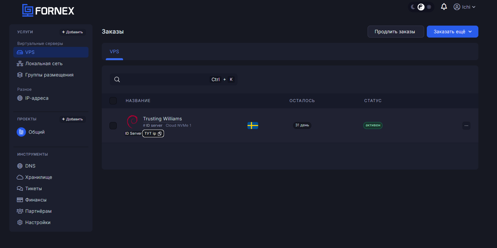
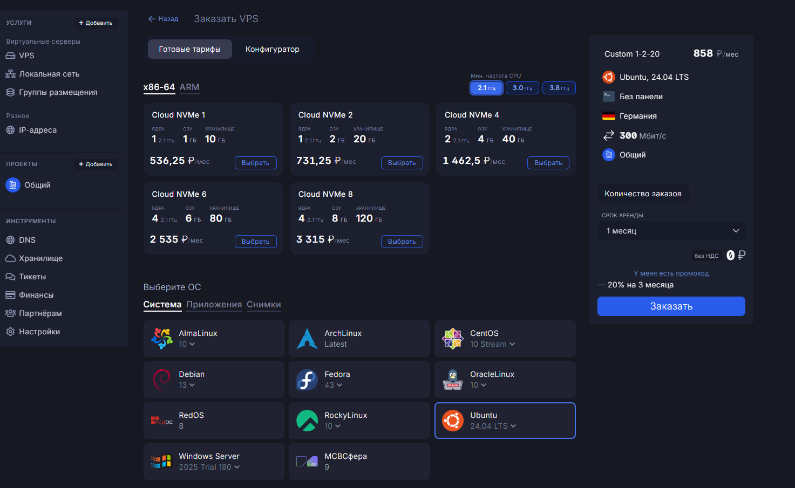
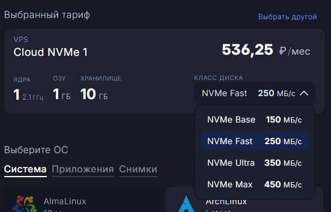
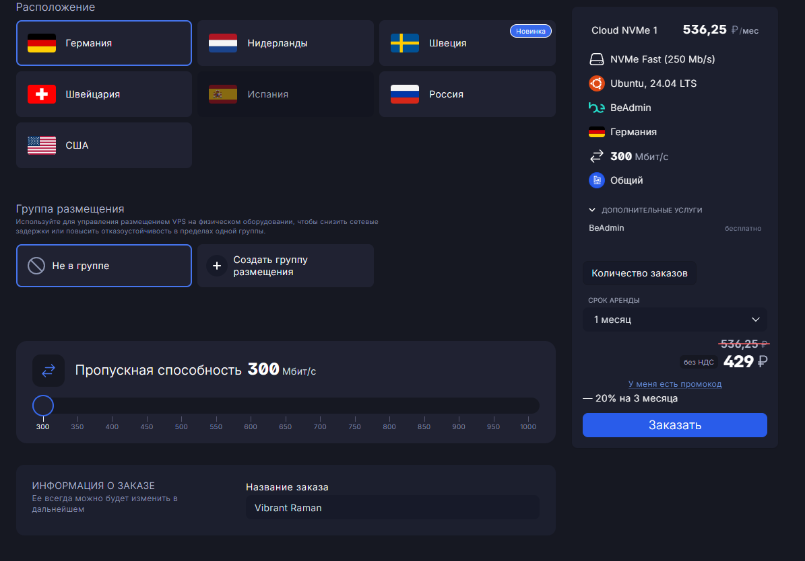
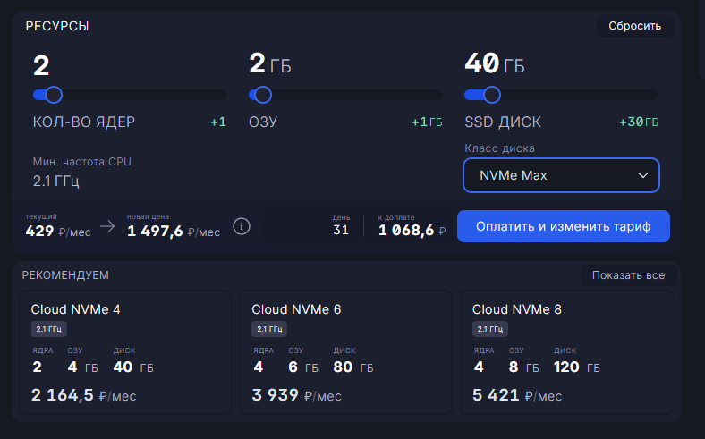

# Fornex

Fornex раньше использовался для нескольких серверов и оставил хорошее впечатление по стабильности и поддержке. В июне 2026 года был сделан свежий тест минимального VPS Cloud NVMe 1, поэтому заметку уже можно оценивать не только по старому опыту.

## Кратко

На 30 июня 2026 года тестировался тариф Cloud NVMe 1: 1 vCPU, 1 ГБ RAM, 10 ГБ SSD, минимальная частота CPU 2.1 ГГц, класс диска NVMe Fast и канал 300 Мбит/с. В панели текущая стоимость этого сервера показывалась как 429 рублей в месяц.

В конфигураторе Fornex можно выбирать минимальную частоту CPU, класс диска и пропускную способность сети. При изменении тарифа панель пересчитывает новую месячную стоимость и сумму к доплате за оставшийся период, то есть оплачивается только разница.

По коммуникации есть хороший знак: при срочных технических работах Fornex присылает письмо с причиной, ожидаемым временем простоя и окном работ. В уведомлении от 8 июля 2026 года по обновлению гипервизора были указаны простой до 30 минут, окно работ 11:00-19:00 (Asia/Yekaterinburg), сохранность данных и автоматический запуск сервера после обновления платформы.

## Контекст использования

Раньше было несколько серверов. Они работали стабильно, а техническая поддержка отвечала быстро. Потом использование прекратилось из-за роста цен.

Свежий тест сделан на VPS Fornex 30 июня 2026 года. В списке заказов сервер отображался как Cloud NVMe 1 в шведской локации. Скриншоты оформления ниже показывают не только сам тестовый тариф, но и возможности конфигуратора при новом заказе.

## Скриншоты

В списке заказов активен сервер Cloud NVMe 1.

На странице заказа видны готовые тарифы Cloud NVMe и выбор минимальной частоты CPU: 2.1, 3.0 или 3.8 ГГц.

Класс диска выбирается отдельно: NVMe Base, NVMe Fast, NVMe Ultra или NVMe Max.

Пропускная способность сети тоже настраивается в конфигураторе. На скриншоте выбран базовый вариант 300 Мбит/с.

При изменении тарифа Fornex показывает текущую цену, новую цену, число дней и сумму к доплате.

## Тарифы и конфигуратор

На скриншоте с готовыми тарифами для x86-64 были видны такие варианты при минимальной частоте CPU 2.1 ГГц:

| Тариф | CPU | RAM | Диск | Цена в панели |
| --- | ---: | ---: | ---: | ---: |
| Cloud NVMe 1 | 1 ядро | 1 ГБ | 10 ГБ | 536,25 ₽/мес |
| Cloud NVMe 2 | 1 ядро | 2 ГБ | 20 ГБ | 731,25 ₽/мес |
| Cloud NVMe 4 | 2 ядра | 4 ГБ | 40 ГБ | 1 462,5 ₽/мес |
| Cloud NVMe 6 | 4 ядра | 6 ГБ | 80 ГБ | 2 535 ₽/мес |
| Cloud NVMe 8 | 4 ядра | 8 ГБ | 120 ГБ | 3 315 ₽/мес |

Для тестового Cloud NVMe 1 в панели заказов текущая цена была 429 ₽/мес. Судя по форме заказа, это связано со скидкой 20% на 3 месяца: базовая цена 536,25 ₽/мес превращается в 429 ₽/мес.

Классы диска в выпадающем списке:

| Класс диска | Заявленная скорость |
| --- | ---: |
| NVMe Base | 150 МБ/с |
| NVMe Fast | 250 МБ/с |
| NVMe Ultra | 350 МБ/с |
| NVMe Max | 450 МБ/с |

Пропускная способность в конфигураторе выбирается ползунком от 300 до 1000 Мбит/с. На экране заказа также были видны локации Германия, Нидерланды, Швеция, Швейцария, Испания, Россия и США.

Для изменения уже созданного VPS в панели есть отдельный перерасчет. В примере текущая цена была 429 ₽/мес, новая цена после изменения ресурсов - 1 497,6 ₽/мес, а сумма к доплате за 31 день - 1 068,6 ₽. Это удобнее, чем пересоздавать сервер или оплачивать полный новый месяц.

## Тест Cloud NVMe 1

Тест запускался 30 июня 2026 года на Debian 13. Конфигурация сервера:

| Проверка | Результат |
| --- | --- |
| ОС | Debian GNU/Linux 13 (trixie) |
| Kernel | 6.12.90+deb13.1-amd64 |
| CPU | Intel Xeon Processor (Cascadelake), 1 поток |
| RAM | 967 MiB |
| Диск | 9.8G root-раздел, 7.8G свободно на момент теста |
| Тариф в панели | Cloud NVMe 1, 1 ядро, 1 ГБ RAM, 10 ГБ SSD |
| Класс диска | NVMe Fast, 250 МБ/с |
| Заявленный канал в заказе | 300 Мбит/с |

Быстрый тест российских `iperf3`-точек через itdoginfo:

| Город | Download | Upload | Ping |
| --- | ---: | ---: | ---: |
| Moscow | 276.7 Мбит/с | 505.6 Мбит/с | 39 ms |
| Saint Petersburg | 303.4 Мбит/с | 511.8 Мбит/с | 27 ms |
| Nizhny Novgorod | 275.7 Мбит/с | 504.5 Мбит/с | 37 ms |
| Chelyabinsk | 244.1 Мбит/с | 455.3 Мбит/с | 58 ms |
| Tyumen | 247.9 Мбит/с | 461.2 Мбит/с | 56 ms |

Ручные 30-секундные проверки `iperf3`:

| Точка `iperf3` | Upload с VPS | Download на VPS |
| --- | ---: | ---: |
| Moscow | сервер был занят | сервер был занят |
| Nizhny Novgorod | 292 Мбит/с | 322 Мбит/с |
| Tyumen | 283 Мбит/с | 311 Мбит/с |
| Netherlands / Serverius | 277 Мбит/с | 332 Мбит/с |
| France / Paris | сервер был занят | сервер был занят |
| USA / California | сервер был занят | сервер был занят |

На ручных upload-тестах было заметное число retransmits, особенно до Нижнего Новгорода, Тюмени и Нидерландов. Поэтому сетевой вывод лучше считать предварительным: пропускная способность выглядит сильной для базового тарифа, но стабильность маршрутов нужно перепроверять в разное время суток.

Задержка:

| Точка | Средний ping |
| --- | ---: |
| 1.1.1.1 | 3.5 ms |
| Ya.ru | 55.7 ms |
| MTS Moscow | 58.1 ms |

Диск в `fio` хорошо совпал с выбранным классом NVMe Fast: последовательное чтение и запись уперлись примерно в заявленные 250 МБ/с.

| Тест диска `fio` | Результат |
| --- | ---: |
| последовательная запись | 251 MiB/s |
| последовательное чтение | 251 MiB/s |
| случайное чтение 4K, 70/30 randrw | 5447 IOPS, 21.3 MiB/s |
| случайная запись 4K, 70/30 randrw | 2333 IOPS, 9333 KiB/s |

CPU и память в `sysbench`:

| Тест | Результат |
| --- | ---: |
| CPU, 1 поток | 434.42-434.45 events/s |
| память, 1 поток | 5166.33 MiB/s |

Короткий вывод по тесту: Cloud NVMe 1 у Fornex выглядит нормальным минимальным VPS для небольших сервисов, если хватает 1 ГБ RAM. Диск на NVMe Fast предсказуемо ограничен около выбранного лимита, сеть в быстрых тестах по РФ дает примерно 244-303 Мбит/с download и 455-512 Мбит/с upload, но ручные `iperf3`-замеры стоит повторять из-за retransmits.

## Регистрация и бонусы

Есть регистрационная ссылка с бонусами: [fornex.com/code/0n32u4](https://fornex.com/code/0n32u4/).

По переданной информации, для этой ссылки действуют скидки:

- 10% на AntiDDoS;
- 10% на бэкапы;
- 10% на сервер;
- 10% на хостинг;
- 10% на VPS;
- 10% на ATS;
- 10% на switch;
- 10% на rack;
- 2% на DNS.

## Плюсы

- старые серверы работали стабильно;
- техническая поддержка раньше отвечала быстро;
- есть свежий тест минимального VPS, а не только старый опыт;
- при срочных работах присылают письмо с причиной, ожидаемым простоем и временным окном;
- в конфигураторе можно выбрать частоту CPU, класс диска и пропускную способность сети;
- скорость диска в тесте соответствует выбранному классу NVMe Fast;
- при изменении тарифа панель считает доплату только за изменение на оставшийся период.

## Минусы и риски

- раньше провайдер поднял цены, из-за чего использование было прекращено;
- итоговая цена зависит от скидки, срока аренды и выбранных опций, поэтому ее нужно проверять прямо перед заказом;
- 1 ГБ RAM на минимальном тарифе подходит не для всех задач;
- в ручных сетевых тестах были retransmits, поэтому сеть нужно повторно проверять под свою задачу;
- бонусы по регистрационной ссылке стоит проверять перед заказом, потому что условия акций могут меняться;
- тест одного VPS не заменяет долгую проверку стабильности 3-7 дней под реальной нагрузкой.

## Итог

Fornex снова выглядит рабочим кандидатом для небольших VPS: панель стала гибкой, можно управлять диском, сетью и CPU, а минимальный Cloud NVMe 1 за 429 ₽/мес по текущей скидке показал нормальные результаты.

Главная оговорка - это пока короткий тест одного сервера. Для рабочего проекта нужно повторить сетевые замеры, проверить стабильность несколько дней, включить базовую защиту VPS и сравнить итоговую цену без временной скидки.

## Источники

- [Fornex: регистрационная ссылка с бонусами](https://fornex.com/code/0n32u4/)
- Скриншоты личного кабинета Fornex от 30 июня 2026 года
- Личный тест VPS Fornex Cloud NVMe 1 от 30 июня 2026 года
- Личное уведомление Fornex о срочном обновлении гипервизора от 8 июля 2026 года
