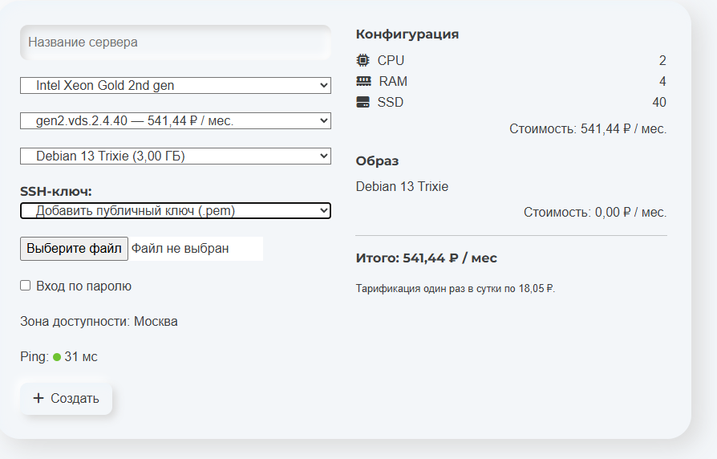
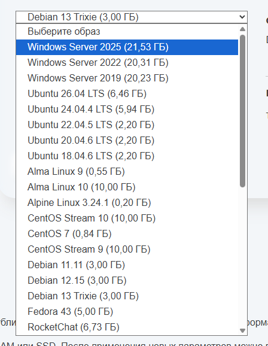
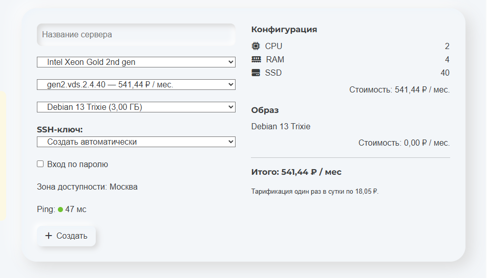
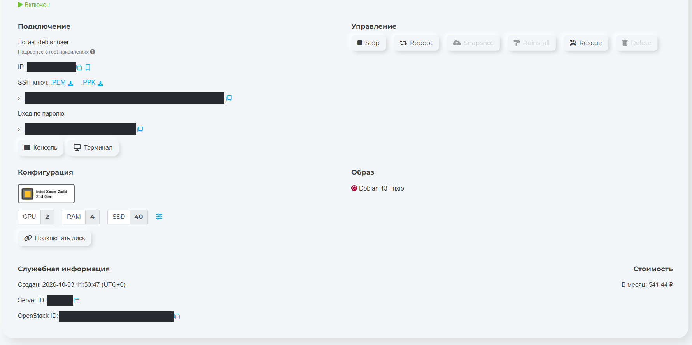
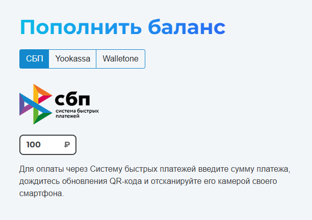
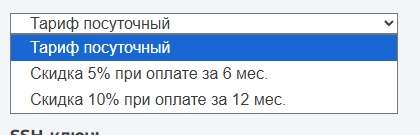
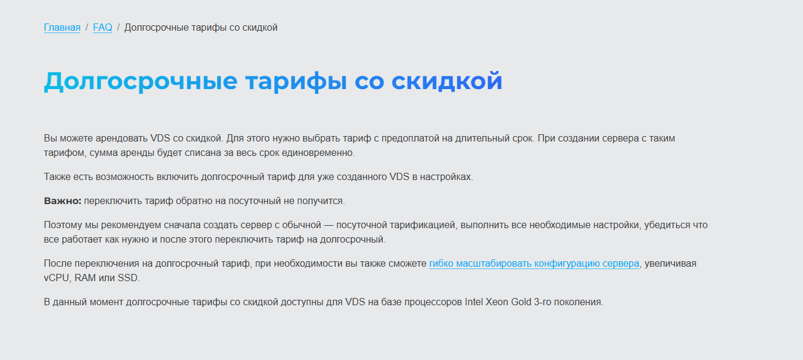
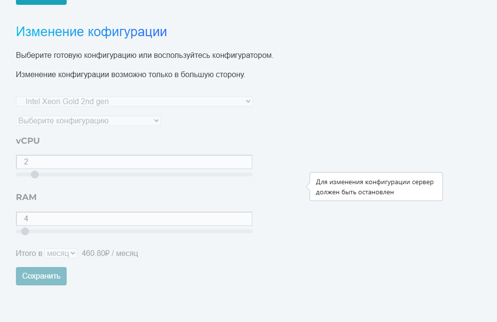
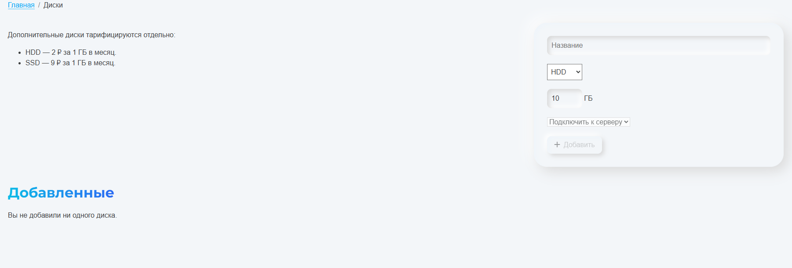
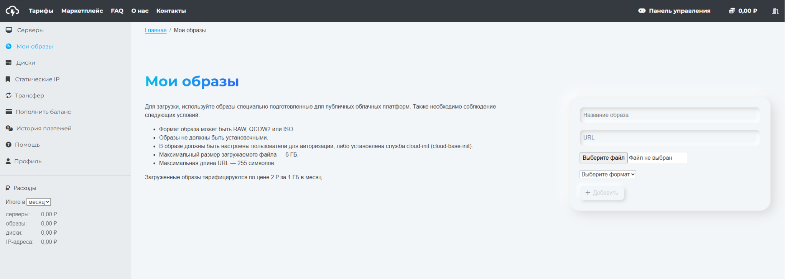

# HSVDS: личный тест VDS 2/4/40, кабинет и ограничения

<a href="https://hsvds.ru/signup/?refid=20261003-1022793-172" rel="sponsored nofollow">Зарегистрироваться в HSVDS — реферальная ссылка</a>.

**3 октября 2026 года** начат личный тест HSVDS: московский VDS на Intel Xeon Gold 2nd gen, **2 vCPU / 4 ГБ RAM / 40 ГБ SSD за 541,44 ₽ в месяц**. Вместо прежнего «личного опыта пока нет» здесь теперь наблюдения из кабинета и результаты одного запуска тестового скрипта.

**Предварительный вывод:** высокая пропускная способность до нескольких российских тестовых узлов и хорошие для выбранных режимов результаты диска. Но зарубежные направления дали неоднородный результат, а поддержка, восстановление копий и длительная стабильность ещё не проверены. Категория пока **«Кандидаты на тест»**, уже с начатым личным тестированием, не безусловная рекомендация.

## Источники и границы проверки

Основа материала — предоставленные автором 10 скриншотов кабинета, HTML конструктора, описание регистрации и консольный лог. Основная часть теста датирована **3 октября, 12:02:40–12:17:19 UTC**, то есть **17:02:40–17:17:19 по Екатеринбургу, UTC+5**. Это время по журналу VPS, не независимая проверка его часов.

Публичные страницы тарифов и FAQ отдельно прочитаны 3 октября. Сведения из документации ниже помечены отдельно от выполненных операций. Из внешнего сеанса страница кабинета требует входа: содержание авторизованного интерфейса подтверждается материалами автора, не входом редактора в его аккаунт.

Цены и список образов — снимок состояния, **не новость об изменении тарифов или датах релизов ОС**. Изображения сохранены без перерисовки интерфейса; адрес сервера, команды с адресом и именем ключа, Server ID и OpenStack ID закрыты непрозрачными масками.

## Регистрация и первое впечатление

По личному опыту автора, регистрация требует активации через email; туда же отправляется пароль аккаунта. Интерфейс воспринимается устаревшим, «примерно как в 2000-х», но это субъективное впечатление, не оценка надёжности инфраструктуры. Полезная деталь — рядом с каждым образом сразу показан его размер.

Отправку пароля по почте стоит учитывать при защите аккаунта: разумно сменить выданный пароль и защитить почтовый ящик. Сам факт письма **не доказывает**, как провайдер хранит пароли в базе. Отдельно в [публичном FAQ](https://hsvds.ru/faq/) описана SMS-2FA; её включение в данном тесте не показано.

## Конструктор и выбранный тариф

В конструкторе можно выбрать Xeon Gold 2-го или 3-го поколения. Ниже цены **именно Gen2** из переданного HTML; другие поколения не тестировались.

| vCPU | RAM, ГБ | SSD, ГБ | Цена в панели, ₽/мес. |
| ---: | ---: | ---: | ---: |
| 1 | 1 | 10 | 185,76 |
| 1 | 2 | 20 | 270,72 |
| **2** | **4** | **40** | **541,44** |
| 4 | 8 | 80 | 1 082,88 |
| 6 | 12 | 120 | 1 624,32 |
| 8 | 16 | 160 | 2 165,76 |
| 10 | 20 | 200 | 2 707,20 |
| 12 | 24 | 240 | 3 248,64 |
| 14 | 28 | 280 | 3 790,08 |
| 16 | 32 | 320 | 4 331,52 |

Выбран `gen2.vds.2.4.40` с Debian 13 Trixie. Панель показывает **541,44 ₽/мес.**, **18,05 ₽ за сутки**, стоимость выбранного образа **0,00 ₽/мес.** и локацию **Москва**. Это отображаемый расчёт, а не выписка всех фактических списаний. Суточная сумма округлена на экране; точный алгоритм округления биллинга здесь не установлен.

Показатель Ping в разных материалах конструктора равен 31, 47 и 329 мс. Метод и точка измерения в них не раскрыты; это **не постоянная задержка VPS** и не замена замерам из консоли ниже.

## Образы ОС и приложений

Для Debian 13 Trixie показано **3,00 ГБ**, Alpine Linux 3.24.1 — **0,20 ГБ**, Windows Server 2025 — **21,53 ГБ**. Это удобно при выборе небольшого диска. Но поле размера образа нельзя автоматически считать фактическим занятым местом после установки: в тестовом `df` корень занимал примерно **1,2 ГБ**. Определение поля в панели отдельно не подтверждено.

В HTML также видны готовые образы LAMP/LEMP, Docker, Gitea, GitLab, Jenkins, Nextcloud и AI-приложений. Наличие пункта в списке не означает, что каждый образ был установлен и проверен.

Полный список из переданного конструктора, 3 октября 2026

| Образ — название в панели | Показанный размер, ГБ |
| --- | ---: |
| Windows Server 2025 | 21,53 |
| Windows Server 2022 | 20,31 |
| Windows Server 2019 | 20,23 |
| Ubuntu 26.04 LTS | 6,46 |
| Ubuntu 24.04.4 LTS | 5,94 |
| Ubuntu 22.04.5 LTS | 2,20 |
| Ubuntu 20.04.6 LTS | 2,20 |
| Ubuntu 18.04.6 LTS | 2,20 |
| Alma Linux 9 | 0,55 |
| Alma Linux 10 | 10,00 |
| Alpine Linux 3.24.1 | 0,20 |
| CentOS Stream 10 | 10,00 |
| CentOS 7 | 0,84 |
| CentOS Stream 9 | 10,00 |
| Debian 11.11 | 3,00 |
| Debian 12.15 | 3,00 |
| Debian 13 Trixie | 3,00 |
| Fedora 43 | 5,00 |
| RocketChat | 6,73 |
| Rocky Linux 9.8 | 10,00 |
| Gitea | 10,00 |
| Django | 5,00 |
| LAMP | 5,00 |
| LEMP | 5,00 |
| Jenkins | 13,44 |
| Docker + Docker Compose | 6,50 |
| GitLab | 14,05 |
| Hermes Agent | 6,92 |
| Jitsi Meet | 6,96 |
| Jupyter Notebook | 5,91 |
| LibreChat | 12,53 |
| Nextcloud | 7,95 |
| OpenCode | 6,21 |
| Docker + Portainer | 6,25 |
| Open WebUI | 23,33 |
| OpenClaw | 8,49 |
| cirrOS 0.6.3 | 0,11 |

Это инвентаризация вариантов панели, не рекомендация использовать любой из них. Актуальность поддержки ОС и версии приложений внутри образов требуют отдельной проверки.

## SSH, пароль и работающий сервер

Есть два режима SSH: автоматическое создание ключа и загрузка собственного **публичного** ключа через пункт «Добавить публичный ключ (.pem)». [Официальная инструкция](https://hsvds.ru/faq/?id=131) поясняет: в файл с расширением `.pem` нужно сохранить публичный ключ. Это **не просьба загрузить приватный ключ**. Для подключения приватная часть остаётся у пользователя.

В карточке созданного сервера доступны ссылки на ключ в форматах `.PEM` и `.PPK`. Отдельный флажок «Вход по паролю» в конструкторе сопровождается предупреждением об отправке реквизитов на email. Пароль VPS и пароль аккаунта — разные вещи; из сообщения о регистрации нельзя выводить состояние SSH PasswordAuthentication конкретного сервера.

Практический выбор для постоянной работы — собственная пара ключей, загрузка только публичной части и отсутствие ненужного парольного входа. Наличие скачивания автоматически созданного ключа не устанавливает срок его хранения провайдером.

На скриншоте сервер включён, видны консоль, терминал, Stop, Reboot и Rescue. Snapshot, Reinstall и Delete в этом состоянии неактивны. По серым кнопкам нельзя заключить, что этих функций вообще нет, либо что снапшоты равны включённым резервным копиям. Восстановление и Rescue в тесте не выполнялись.

В предоставленном логе есть рабочая сессия пользователя `debianuser`. Обычный `apt update` завершился отказом в доступе, а `sudo apt update` выполнился: это различие прав пользователя, не сбой VPS. По журналу нельзя определить, каким именно каналом была открыта сессия — внешним SSH, консолью или терминалом панели.

## Оплата и долгосрочные тарифы

В кабинете показаны СБП, YooKassa и Walletone. Поле с суммой 100 ₽ на скриншоте само по себе не подтверждает успешный платёж. **Отдельный источник:** публичный FAQ указывает минимальный платёж 100 ₽; платёжные операции всеми способами здесь не проверялись.

В выборе периода есть посуточная оплата, **скидка 5% за 6 месяцев** и **10% за 12 месяцев**.

Важные ограничения из показанного автором FAQ и [его публичной версии](https://hsvds.ru/faq/?id=139): сумма за весь срок списывается сразу; существующий сервер можно перевести на долгосрочный тариф; **вернуться на посуточную тарификацию нельзя**. В той же инструкции долгосрочные скидки заявлены для **Xeon Gold 3-го поколения**. Тестировался Gen2: скидки нельзя автоматически применять к его цене 541,44 ₽.

**Дополнение из документации, не проверка списаний:** [FAQ по биллингу](https://hsvds.ru/faq/?id=184) указывает списание полных суток после удаления VDS, а при изменении конфигурации внутри суток — расчёт по самой дорогой конфигурации. Посуточность не означает поминутную оплату.

## Масштабирование: только вверх и с остановкой

Панель прямо сообщает: **«Изменение конфигурации возможно только в большую сторону»**. Пока сервер включён, элементы настройки недоступны; подсказка требует остановки. [Публичная инструкция](https://hsvds.ru/faq/?id=125) также описывает остановку перед изменением и последующее включение пользователем. Успешное выполнение resize в материалах не показано.

В отключённой форме расчёта на скриншоте видно **460,80 ₽/мес.**, а в карточке и конструкторе — **541,44 ₽/мес.** Причина различия не установлена: это не следует молча объяснять НДС, IP или скидкой. Для описания заказанного тарифа используется согласованная сумма 541,44 ₽; цену изменения нужно уточнить до операции.

## Дополнительные диски и собственные образы

По экрану «Диски» дополнительные тома оплачиваются отдельно: **HDD — 2 ₽/ГБ в месяц, SSD — 9 ₽/ГБ в месяц**. На скриншоте дополнительных дисков ещё нет. **Отдельно по публичному FAQ:** такие диски сохраняются после удаления сервера и продолжают тарифицироваться; в этом тесте удаление не проверялось.

В «Мои образы» заявлены RAW, QCOW2 и ISO, загрузка по URL или файлом; предел файла **6 ГБ**, URL — **255 символов**. Нужен подготовленный облачный образ с пользователями для входа либо cloud-init / cloud-base-init. Одновременно интерфейс предупреждает, что образ **не должен быть установочным**: упоминание ISO не стоит трактовать как гарантию загрузки произвольного установочного ISO.

Хранение пользовательских образов — **2 ₽/ГБ в месяц**. Это отдельная услуга, не стоимость дополнительного SSD. Импорт, загрузка своей VM и биллинг хранения в данном тесте не проверены.

## Тестовая конфигурация и воспроизводимость

| Параметр | Что показал журнал |
| --- | --- |
| ОС | Debian GNU/Linux 13, trixie |
| Активное ядро во время замеров | `6.12.95+deb13-amd64` |
| CPU | 2 виртуальных CPU, модель `Intel Xeon Processor (Cascadelake)` |
| Виртуализация | KVM |
| RAM | 3,8 GiB; swap отсутствует |
| Корневой диск | 40G, ext4; около 1,2G занято, 37G доступно по `df` |
| IPv6 | Глобальный адрес не найден, в журнале только link-local; проверка пропущена |
| Инструменты | iperf3 3.18, fio 3.39, sysbench 1.0.20 |
| Длительность ручного iperf3 и fio | 30 секунд на успешный тест |
| Параллелизм ручного iperf3 | 5 потоков |
| Файл fio | 4 GiB, `libaio`, `direct=1` |

При первом обновлении ОС найдено 53 обновляемых пакета. Установлено новое ядро `6.12.111+deb13-amd64`, но замеры выполнены на прежнем `6.12.95`: перезагрузка между обновлением и тестом не показана. Установленное ядро нельзя выдавать за уже загруженное.

Использовался `scripts/vps-test-debian13.sh`, скачанный по адресу ветки `main`. **SHA использованной версии в исходном журнале не записан**, поэтому точную редакцию скрипта восстановить только по этому логу нельзя. В статье приведены время, версии инструментов, параметры и результаты, включая неудачные проверки; повторный тест нужно выполнять с фиксированной версией скрипта.

### Быстрый сетевой тест по РФ

Отдельный запуск `itdoginfo/russian-iperf3-servers` в fast-режиме завершился за 38 секунд. Download/Upload оставлены в смысле, заданном выводом этого теста.

| Узел | Download, Мбит/с | Upload, Мбит/с | Ping в выводе, мс |
| --- | ---: | ---: | ---: |
| Москва | 6 649,3 | 6 805,4 | 1 |
| Санкт-Петербург | 4 941,0 | 5 137,2 | 10 |
| Нижний Новгород | 3 680,5 | 3 894,9 | 8 |
| Челябинск | 2 501,5 | 2 663,5 | 36 |
| Тюмень | 851,5 | 1 066,6 | 30 |

Это отдельные короткие измерения, не средние значения следующих 30-секундных прогонов и не гарантированная полоса.

### Ручные iperf3: высокая скорость в РФ, неоднородный зарубежный результат

Указаны итоговые **receiver**-значения. Upload — от VPS к тестовому серверу; Download — от тестового сервера к VPS (`-R`). При расхождении sender/receiver использована принятая сторона, не большая цифра. Каждый успешный запуск — `-P 5 -t 30`.

| Узел | Upload | Download | Примечание |
| --- | ---: | ---: | --- |
| Москва, `mskst.st.mtsws.net:3333` | 5,99 Гбит/с | 4,16 Гбит/с | Есть retransmits |
| Нижний Новгород, `st.nn.ertelecom.ru:5202` | 2,16 Гбит/с | 4,19 Гбит/с | На скачивании sender — 4,31 Гбит/с, не 4,19 |
| Тюмень, `tumst.st.mtsws.net:3333` | Ошибка: `Connection reset by peer` | 3,38 Гбит/с | Ошибка не заменена на нулевой успешный результат |
| Париж, `ping.online.net:5200` | **46,3 Кбит/с** | 2,54 Гбит/с | Резкая асимметрия; почти весь upload стоял |
| Нидерланды, `speedtest.serverius.net:5002` | Тайм-аут 75 с | Тайм-аут 75 с | Код 124; валидного измерения скорости нет |
| Калифорния, `iperf.he.net:5201` | 227 Мбит/с | Ошибка: `Connection refused` | Успешно измерено только одно направление |

На Париж отправитель показал 350 Кбит/с, но получатель — только 46,3 Кбит/с. Прятать этот результат за общей формулировкой «до 10 Гбит/с» нельзя. В то же время один публичный endpoint не доказывает проблему всей международной сети HSVDS. Причина тайм-аутов и асимметрии — удалённый тестовый узел, маршрут, фильтрация или иное — **не установлена**; ТСПУ и блокировку со стороны хостинга тест не подтверждает.

Провайдер заявляет безлимитный входящий/исходящий трафик и канал до 10 Гбит/с. Замеры подтверждают возможность многогигабитной передачи на части направлений **в момент теста**, но не выделенную постоянную полосу и не отсутствие ограничений при длительной нагрузке.

### Задержки, потери и IPv6

В трёх ping-проверках по 10 пакетов потерь не было: средняя задержка до `1.1.1.1` — **1,575 мс**, `ya.ru` — **3,318 мс**, московского MTS endpoint — **2,904 мс**. В MTR по 50 проб конечные узлы также показали 0% потерь. Потери ответов на промежуточных хопах не равны потере пользовательского трафика до назначения; здесь их причина отдельно не проверялась.

Два tracepath закончились по тайм-ауту, а путь до московского MTS endpoint завершился; эти исходы сохранены в логе. Успешные ping не отменяют показанные выше проблемы отдельных TCP-проверок.

Глобального IPv6 в **этой конфигурации** не обнаружено. Это не доказательство отсутствия IPv6 у провайдера вообще: выдачу и настройку нужно проверять отдельно.

### Диск: fio

Все операции — один job, файл 4 GiB, `libaio`, `direct=1`, 30 секунд. Последовательные тесты: блок 1 MiB, глубина очереди 16. Смешанный случайный тест: блок 4 KiB, глубина 32, чтение/запись 70/30.

| Тест | Результат |
| --- | --- |
| Последовательная запись | **912 MiB/s**, или 956 MB/s |
| Последовательное чтение | **1 123 MiB/s**, или 1 177 MB/s |
| Смешанный random 4K — чтение | **32,4 тыс. IOPS**, 126 MiB/s |
| Тот же random 4K — запись | **13,9 тыс. IOPS**, 54,2 MiB/s |
| p99 completion latency random 4K — чтение / запись | **3,425 / 0,914 мс** |

Чтение и запись random — две части **одного смешанного теста**, не отдельные максимумы чистого чтения и чистой записи. Задержки взяты из `clat`, не из полного `lat`. Это измерения виртуального диска; кэширование нижележащего хранилища, гарантия сохранности и производительность синхронных SQL-коммитов не исследованы.

### CPU и память: sysbench

| Режим | Результат |
| --- | ---: |
| CPU, `--cpu-max-prime=20000 --threads=1` | 393,67 events/s |
| CPU, `--cpu-max-prime=20000 --threads=2` | 775,81 events/s |
| Memory, 2 потока, блок 1 KiB, global write | 4 540,49 MiB/s |

Каждый sysbench-прогон здесь длится около **10 секунд**, несмотря на общий параметр 30 секунд для других длительных тестов. Эти числа нельзя сравнивать с результатами другого prime limit, метода или числа потоков, либо выдавать за аппаратную пропускную способность RAM.

## Итог и что осталось проверить

Понравились цена выбранного Gen2, многогигабитная передача по нескольким направлениям РФ, результаты fio в приведённых режимах и отображение размеров образов. Конструктор даёт достаточно информации для старта, несмотря на субъективно устаревший внешний вид.

Оговорки существенны: пароль по email, resize с остановкой и только вверх, необратимый переход на долгосрочный тариф по условиям FAQ, отдельные расходы на диски/образы и неравномерная зарубежная сеть. Расхождение стоимости в неактивной форме resize пока не объяснено.

Категория **«Кандидаты на тест»** сохраняется до более длительной эксплуатации. Перед рабочим проектом нужны повторные замеры в другие часы, проверка нужных зарубежных сервисов и single-stream скорости, поддержки, резервного копирования и восстановления, условий возврата, IPv6 и правил длительной сетевой нагрузки. Наличие API, его возможности и стабильность этим тестом не подтверждены.

<a href="https://hsvds.ru/signup/?refid=20261003-1022793-172" rel="sponsored nofollow">Попробовать HSVDS — реферальная ссылка</a>. Реферальный переход не является основанием повышать оценку провайдера.

## Источники

- Личные наблюдения автора, скриншоты, HTML кабинета и консольный журнал теста от 3 октября 2026; изображения приведены выше.
- [HSVDS: FAQ](https://hsvds.ru/faq/) — отдельно прочитан 3 октября; заявленные условия не приравнены к выполненным операциям.
- [Тарификация](https://hsvds.ru/faq/?id=184), [долгосрочная аренда](https://hsvds.ru/faq/?id=139), [изменение ресурсов](https://hsvds.ru/faq/?id=125), [собственный публичный SSH-ключ](https://hsvds.ru/faq/?id=131).
- [Скрипт SEO Recipes](https://github.com/ichinya/seo_recipes/blob/main/scripts/vps-test-debian13.sh) — ссылка на текущий файл, не утверждение об идентичности использованной версии.
