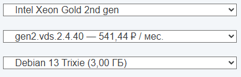
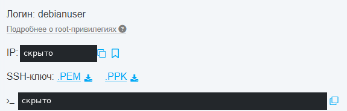

# HSVDS

<a href="https://hsvds.ru/signup/?refid=20261003-1022793-172" rel="sponsored nofollow">Регистрация в HSVDS — реферальная ссылка</a>.

**Первый личный тест — 3 октября 2026 года.** Создан московский VDS на Intel Xeon Gold 2nd gen: **2 vCPU / 4 ГБ RAM / 40 ГБ SSD за 541,44 ₽/мес**, Debian 13 Trixie. Раньше личного опыта с HSVDS в этой карточке не было; теперь есть снимки кабинета и один запуск тестового скрипта.

Первое впечатление: сильные скорости на нескольких российских направлениях и хороший результат файлового теста SSD, но неоднородная международная связность. Категория пока **«Кандидаты на тест»**: первичная проверка выполнена, длительная стабильность, поддержка и восстановление из копии ещё не проверены. Реферальная ссылка не является основанием для повышения оценки.

## Источники и границы проверки

Основные источники — личные замечания автора, десять скриншотов, HTML конструктора и терминальный лог от **3 октября 2026 года**. Публичные тарифы и FAQ дополнительно сверены в тот же день; закрытый `/server/` без авторизации перенаправляет на вход, поэтому сведения из кабинета основаны именно на предоставленных снимках, не на независимом входе в аккаунт.

[Обезличенная выборка из лога с командами и результатами](./hsvds-test-2026-10-03.txt) позволяет проверить цифры ниже. Это выдержки, а не полный исходный лог. IP, имена машины, идентификаторы и ссылки на приватные ключи не публикуются. На фрагментах скриншотов скрытые участки закрыты непрозрачно; цифры конфигурации и результатов не менялись.

## Регистрация и первое впечатление от интерфейса

При регистрации понадобилась активация по email; по личному наблюдению, пароль аккаунта тоже пришёл в письме. Это нежелательный способ доставки секрета, но **сам по себе он не доказывает хранение паролей в открытом виде**. После такого старта разумно задать уникальный пароль. В [публичном FAQ](https://hsvds.ru/faq/) отдельно описана двухфакторная аутентификация по СМС; её работа в этом тесте не проверялась.

По впечатлению автора, интерфейс выглядит примерно как из 2000-х. Это субъективная оценка дизайна, не измерение надёжности. Полезная деталь — конструктор сразу показывает размер выбранного образа и отдельно его стоимость.

## Конструктор и цена выбранного VPS

В форме можно выбрать Intel Xeon Gold второго или третьего поколения. Таблица ниже — **снимок списка Gen2**, а не сравнение производительности двух поколений.

| Конфигурация | vCPU | RAM, ГБ | SSD, ГБ | Цена, ₽/мес |
| --- | ---: | ---: | ---: | ---: |
| `gen2.vds.1.1.10` | 1 | 1 | 10 | 185,76 |
| `gen2.vds.1.2.20` | 1 | 2 | 20 | 270,72 |
| **`gen2.vds.2.4.40` — протестирован** | **2** | **4** | **40** | **541,44** |
| `gen2.vds.4.8.80` | 4 | 8 | 80 | 1 082,88 |
| `gen2.vds.6.12.120` | 6 | 12 | 120 | 1 624,32 |
| `gen2.vds.8.16.160` | 8 | 16 | 160 | 2 165,76 |
| `gen2.vds.10.20.200` | 10 | 20 | 200 | 2 707,20 |
| `gen2.vds.12.24.240` | 12 | 24 | 240 | 3 248,64 |
| `gen2.vds.14.28.280` | 14 | 28 | 280 | 3 790,08 |
| `gen2.vds.16.32.320` | 16 | 32 | 320 | 4 331,52 |

У выбранного Debian 13 Trixie показаны **3,00 ГБ** и **0,00 ₽/мес за образ**. Итог — **541,44 ₽/мес**, списание раз в сутки **по 18,05 ₽**. Это два отображаемых значения; правило округления суточного списания по одному снимку не устанавливается.

В двух снимках конструктор показывал Ping **31 и 47 мс**, а в переданном HTML — **329 мс**. Метод измерения и маршрут интерфейса не установлены. Эти значения нельзя объединять с серверными `ping`/`iperf3` или считать гарантированной задержкой VPS.

### SSH-ключи и первый вход

Доступны автоматическое создание ключа и загрузка собственного **публичного** ключа через файл `.pem`. По FAQ это файл с текстом публичного ключа; загружать приватную часть не требуется. Для автоматически созданного ключа в карточке видны варианты скачивания `.PEM` и `.PPK`.

Вход по паролю включается отдельной галочкой; подсказка сообщает об отправке реквизитов на email. Это настройка доступа к VDS, отдельная от пароля аккаунта. Для Debian в созданной машине указан пользователь `debianuser`, а административные действия в логе выполняются через `sudo`.

Первый `apt update` без `sudo` получил отказ в доступе, после `sudo apt update` обновление прошло. Это не неисправность VPS. Терминальный сеанс подтверждён логом, но транспорт этого сеанса — внешний SSH или терминал панели — из лога отдельно не устанавливается.

В карточке видны консоль, терминал, Stop, Reboot и Rescue. Snapshot, Reinstall и Delete на снимке неактивны: это состояние кнопок работающей машины, а не доказательство отсутствия функций. Переустановка, rescue и восстановление snapshot в личном тесте не выполнялись.

## Образы ОС и приложений

В списке отображались Windows Server 2019/2022/2025; Ubuntu 18.04.6, 20.04.6, 22.04.5, 24.04.4 и 26.04 LTS; Debian 11.11, 12.15 и 13 Trixie; AlmaLinux 9/10, Alpine 3.24.1, CentOS 7, CentOS Stream 9/10, Fedora 43, Rocky Linux 9.8 и cirrOS 0.6.3.

Примеры размеров **из интерфейса**, не измерения установленной файловой системы:

| Образ | Показанный размер, ГБ |
| --- | ---: |
| Alpine Linux 3.24.1 | 0,20 |
| Alma Linux 9 | 0,55 |
| Debian 13 Trixie | 3,00 |
| Ubuntu 26.04 LTS | 6,46 |
| Windows Server 2025 | 21,53 |
| Open WebUI | 23,33 |

Из приложений предлагались Docker + Compose и Docker + Portainer, LAMP/LEMP, Django, Gitea, GitLab, Jenkins, Jupyter Notebook, RocketChat, Jitsi Meet и Nextcloud. Из AI-образов — Hermes Agent, OpenCode, LibreChat, Open WebUI и OpenClaw. Их установка, версия приложений и безопасность не проверялись: это фиксация доступных пунктов меню, не рекомендация каждого образа.

Наличие старого дистрибутива в списке не подтверждает его актуальную поддержку. Проверенный образ здесь только Debian 13. Его размер в меню **3 ГБ** не равен фактическому занятию root: во время теста `df` показывал около **1,2 ГБ** использованного места.

### Собственные образы и дополнительные диски

Снимок раздела «Мои образы» указывает RAW, QCOW2 и ISO, максимальный файл **6 ГБ**, URL до **255 символов**, подготовленные учётные записи либо `cloud-init` / `cloud-base-init`. Одновременно написано, что образы **не должны быть установочными**. Поэтому наличие ISO в списке форматов не следует трактовать как обещание загрузки любого установочного ISO.

| Дополнительный ресурс | Цена по кабинету |
| --- | ---: |
| Хранение собственного образа | 2 ₽ за ГБ/мес |
| Дополнительный HDD | 2 ₽ за ГБ/мес |
| Дополнительный SSD | 9 ₽ за ГБ/мес |

Это дополнительные ресурсы, не новая оценка цены включённого в тариф SSD. Собственный образ и дополнительные диски в этом тесте не загружались и не подключались. В FAQ отдельно предупреждается, что дополнительные диски после удаления VDS сохраняются и продолжают оплачиваться; их жизненный цикл нужно учитывать отдельно.

## Оплата, долгосрочная аренда и изменение конфигурации

В кабинете видны способы пополнения **СБП, Yookassa и Walletone**. Снимок с введёнными 100 ₽ не доказывает успешный платёж этим способом. Публичный FAQ отдельно указывает минимальное пополнение **100 ₽**, оплату полных суток при удалении VDS в день создания и списание по самой дорогой конфигурации, если в течение суток она менялась.

В выпадающем списке есть скидки **5% за 6 месяцев** и **10% за 12 месяцев**. Существенные условия из снимка FAQ: вся сумма списывается сразу, существующий сервер можно перевести на долгосрочный тариф, но **обратно на посуточный — нельзя**. Там же долгосрочные скидки ограничены **Xeon Gold третьего поколения**. Не применяем их автоматически к протестированному Gen2. Публичный FAQ на дату проверки подтверждает это ограничение.

Раздел изменения конфигурации прямо сообщает: **только увеличение ресурсов**, причём **сервер должен быть остановлен**. Это не бесшовное масштабирование работающего приложения. На отключённой форме resize виден итог **460,80 ₽/мес**, тогда как создание и карточка показывают **541,44 ₽/мес**. Состав разницы не установлен: меньшую сумму не выдаём за новую полную стоимость VDS. Resize и фактические списания после него не проверялись.

## Условия тестирования

По часовым отметкам самого лога: **3 октября 2026, 12:02:40–12:17:19 UTC**, то есть **17:02:40–17:17:19 по Екатеринбургу (UTC+5)**. Это один короткий прогон на одной VM, не многодневное наблюдение.

| Параметр | Зафиксировано |
| --- | --- |
| Локация и тариф | Москва по панели; Gen2 2/4/40 |
| ОС | Debian GNU/Linux 13, trixie |
| Запущенное ядро | `6.12.95+deb13-amd64` |
| CPU в гостевой ОС | Intel Xeon Processor (Cascadelake), 2 vCPU |
| Виртуализация | KVM, по `lscpu` |
| Память | 3,8 GiB; swap не настроен |
| Root | ext4, около 40G; 1,2G использовано, 37G доступно |
| Инструменты | iperf3 3.18; fio 3.39; sysbench 1.0.20 |
| Ручные сетевые прогоны | 5 потоков, по 30 секунд; внешний timeout 75 секунд |
| fio | файл 4G на root, `libaio`, `direct=1`, один job, по 30 секунд |
| sysbench CPU | `cpu-max-prime=20000`, 1 и 2 потока, фактически около 10 секунд |

Перед тестом были установлены 53 обновления и новое ядро `6.12.111+deb13-amd64`, но `uname` в замерах всё ещё показывает **6.12.95**. Перезагрузка в новое ядро до измерений не подтверждена.

Запущен [скрипт SEO Recipes](https://github.com/ichinya/seo_recipes/blob/main/scripts/vps-test-debian13.sh), внутри — быстрый тест [itdoginfo](https://github.com/itdoginfo/russian-iperf3-servers). SHA загруженных скриптов в исходном логе не записаны; текущий `main` не выдаётся за точно установленную версию тогдашнего запуска. Параметры команд и вывод сохранены в обезличенной выборке. Повторно на сервере эти тесты при подготовке статьи не запускались.

## Сеть: российские направления

### Быстрый тест itdoginfo

Столбцы Download/Upload и Ping перенесены из таблицы скрипта; время выполнения — **38 секунд**.

| Направление | Download, Мбит/с | Upload, Мбит/с | Ping, мс |
| --- | ---: | ---: | ---: |
| Москва | 6 649,3 | 6 805,4 | 1 |
| Санкт-Петербург | 4 941,0 | 5 137,2 | 10 |
| Нижний Новгород | 3 680,5 | 3 894,9 | 8 |
| Челябинск | 2 501,5 | 2 663,5 | 36 |
| Тюмень | 851,5 | 1 066,6 | 30 |

### Отдельные ручные iperf3

Здесь **Upload — от VPS, Download — к VPS**, для обоих направлений взят итог `receiver`. Это другие прогоны: их не усредняем с быстрым тестом.

| Сервер тестирования | Upload, Гбит/с | Download, Гбит/с |
| --- | ---: | ---: |
| Москва, `mskst.st.mtsws.net:3333` | 5,99 | 4,16 |
| Нижний Новгород, `st.nn.ertelecom.ru:5202` | 2,16 | 4,19 |
| Тюмень, `tumst.st.mtsws.net:3333` | Нет результата: connection reset | 3,38 |

На нескольких направлениях получены многогигабитные скорости. Это согласуется с возможностью канала до 10 Гбит/с, заявленной провайдером, но не доказывает выделенную или постоянно гарантированную полосу. Длительный расход трафика, fair use и влияние соседей не проверены.

## Международная сеть: важная асимметрия

Те же `-P 5 -t 30`, итоги стороны `receiver`:

| Направление | От VPS | К VPS |
| --- | ---: | ---: |
| Париж, `ping.online.net:5200` | **46,3 Кбит/с** | **2,54 Гбит/с** |
| Нидерланды, `speedtest.serverius.net:5002` | Нет результата: timeout | Нет результата: timeout |
| Калифорния, `iperf.he.net:5201` | **227 Мбит/с** | Нет результата: connection refused |

У Парижа действительно получилась очень большая разница направлений: почти отсутствующая отправка при гигабитной загрузке. Но **причина не установлена**: из одного публичного тестового сервера нельзя вывести ни блокировку ТСПУ, ни неисправность всей зарубежной сети HSVDS. Отказы и timeout не подменяем числом 0 Мбит/с. Сам лог предупреждает, что публичные iperf-серверы могут быть заняты.

В отдельных успешных прогонах есть много TCP retransmissions. Это сигнал для повторной проверки, не готовый процент потерь пакетов и не доказательство вины провайдера. Для проекта с важным зарубежным API или внешними копиями эти конкретные маршруты нужно проверить отдельно.

### Ping, MTR и IPv6

В десяти ICMP-запросах средняя задержка до Cloudflare DNS составила **1,575 мс**, до `ya.ru` — **3,318 мс**, до московского сервера MTS — **2,904 мс**; получены все десять ответов. В последующих MTR конечные узлы также показывают **0% из 50 проб**. Эти короткие выборки не подтверждают месячный SLA. Неответы промежуточных узлов MTR не переносим на итоговую доставку.

**Глобального IPv6 у протестированной VM не обнаружено**: есть только link-local, глобального маршрута нет, IPv6-тест пропущен. Это состояние конкретной машины, а не установленное отсутствие услуги IPv6 у HSVDS вообще.

## SSD: fio

Тестировался файл на корневой файловой системе, не весь raw-диск. Последовательные операции — блок **1 MiB**, глубина очереди **16**. Смешанная случайная нагрузка — **4 KiB**, **70% чтения / 30% записи**, глубина **32**.

| Нагрузка | Пропускная способность | IOPS | p99 времени завершения I/O (`clat`) |
| --- | ---: | ---: | ---: |
| Последовательная запись | **912 MiB/s** (956 MB/s) | 911 | 33,817 мс |
| Последовательное чтение | **1 123 MiB/s** (1 177 MB/s) | 1 122 | 35 мс |
| Случайное чтение, часть 70/30 | **126 MiB/s** | **32,4 тыс.** | 3,425 мс |
| Случайная запись, часть 70/30 | **54,2 MiB/s** | **13,9 тыс.** | 0,914 мс |

У всех трёх fio jobs `err=0`. Последние две строки — части **одного смешанного теста**, не отдельные чистые random-read/random-write. Для первичной проверки результат выглядит хорошо, но это не тест синхронного commit базы данных: `fsync`/durability не измерялись, а глубина очереди заметно влияет на latency. Результат виртуального SSD не устанавливает тип физических накопителей и не доказывает NVMe.

## CPU и память

| Проверка | Результат |
| --- | ---: |
| sysbench CPU, prime 20000, 1 поток | **393,67 events/s** |
| sysbench CPU, prime 20000, 2 потока | **775,81 events/s** |
| sysbench memory, 2 потока, запись блоками 1 KiB, global | **4 540,49 MiB/s** |

CPU-прогоны и тест памяти длились примерно по **10 секунд**, несмотря на общий параметр 30 секунд для длинных сетевых/fio-тестов. Это синтетические результаты; скорость WordPress, Laravel, PHP или рабочей БД ими не измерена. Долговременная загрузка CPU и steal time не исследованы.

## Итог первого теста

Понравились доступная конфигурация **2/4/40 за 541,44 ₽**, показ размеров образов, выбор своего SSH-ключа, собственные образы и дополнительные диски. По российским направлениям и файловому SSD-тесту есть сильные цифры, а не только рекламное обещание канала.

Оговорки: пароль приходит в email, визуально устаревший интерфейс, рост конфигурации только после остановки, невозвратность долгосрочного тарифа к посуточному и неоднородная международная сеть. Отдельно остаётся непонятной сумма в форме resize. Эти пункты имеют разный вес: дизайн субъективен, ограничения тарифа документированы, сеть требует повторных замеров.

**Категория остаётся «Кандидаты на тест», с отметкой о выполненном первом личном тесте.** Для перехода в «Норм» нужны повторные замеры нужных маршрутов, период наблюдения за доступностью, проверка резервных копий/restore, поддержки, возврата и итоговых списаний. До этого HSVDS выглядит интересным для недорогого тестового сервера, но универсальной рекомендации по одному прогону нет.

<a href="https://hsvds.ru/signup/?refid=20261003-1022793-172" rel="sponsored nofollow">Перейти к регистрации HSVDS (реферальная ссылка)</a>.

## Источники

- Личный опыт, HTML конструктора и скриншоты автора от 3 октября 2026 года; две иллюстрации выше опубликованы после обезличивания.
- [Выдержки из терминального лога: параметры и результаты](./hsvds-test-2026-10-03.txt).
- [Публичный FAQ HSVDS](https://hsvds.ru/faq/) — дополнительно прочитан 3 октября; условия оплаты, SSH и долгосрочных тарифов отделены от выполненных действий.
- [Маркетплейс образов](https://hsvds.ru/marketplace/) — каталог возможностей, не подтверждение установки каждого приложения.
