# MakeCloud

[MakeCloud](https://lk.makecloud.ru/register?ref_code=730843a1be5f4d099c0b) - российский облачный провайдер на платформе OpenStack: VPS/VDS, S3-хранилище и Kubernetes. 14 июля 2026 года были проверены личный кабинет, создание виртуального дата-центра и минимальный VPS. Сервер показал сильные результаты сети и диска, но это один короткий тест, поэтому MakeCloud пока остается кандидатом на дальнейшую проверку, а не безусловной рекомендацией.

## Личный тест кабинета — 14 июля 2026 года

Для теста использовалась [регистрация в MakeCloud](https://lk.makecloud.ru/register?ref_code=730843a1be5f4d099c0b).

> Ссылка на регистрацию реферальная. Цены и интерфейс ниже зафиксированы на 14 июля 2026 года и могут измениться.

### Письмо с просьбой пополнить баланс

Сразу после регистрации пришло автоматическое письмо с просьбой пополнить баланс. В письме указано, что баланс аккаунта снизился до критического значения **50 ₽**, и рекомендуется внести деньги, чтобы избежать перебоев в работе инфраструктуры. На этот момент инфраструктура еще не была создана, поэтому это выглядит как стандартное уведомление по порогу баланса для нового аккаунта.

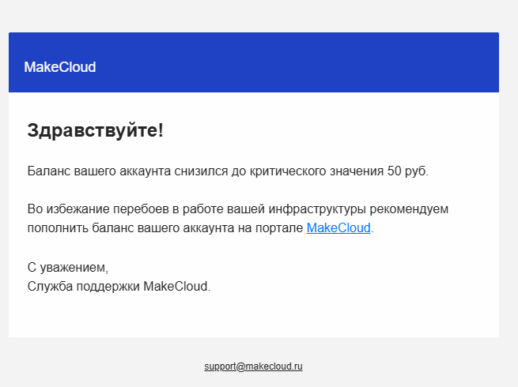

### Сначала ВЦОД, потом сервер

После регистрации и пополнения баланса сначала создается **виртуальный центр обработки данных (ВЦОД)**. Только затем внутри ВЦОД можно заказывать серверы, диски, публичные IP-адреса и сети. Это отличается от классических VPS-провайдеров, где после оплаты сразу создается одна виртуальная машина.

До создания ВЦОД панель показывает доступные ресурсы проекта и кнопку «Создать ВЦОД».

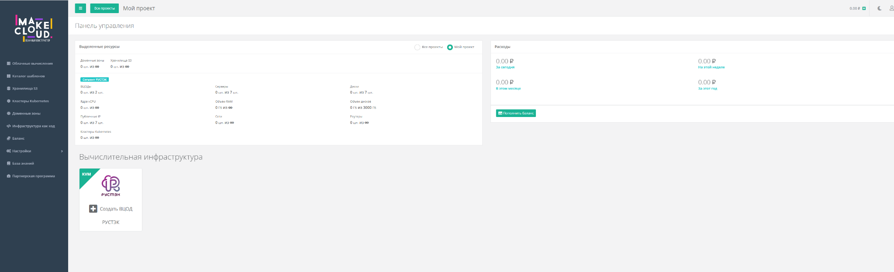

После создания ВЦОД в разделе облачных вычислений появляется отдельный контур, внутри которого уже доступны серверы, сети, роутеры, IP-адреса, профили безопасности, резервное копирование, диски и образы.

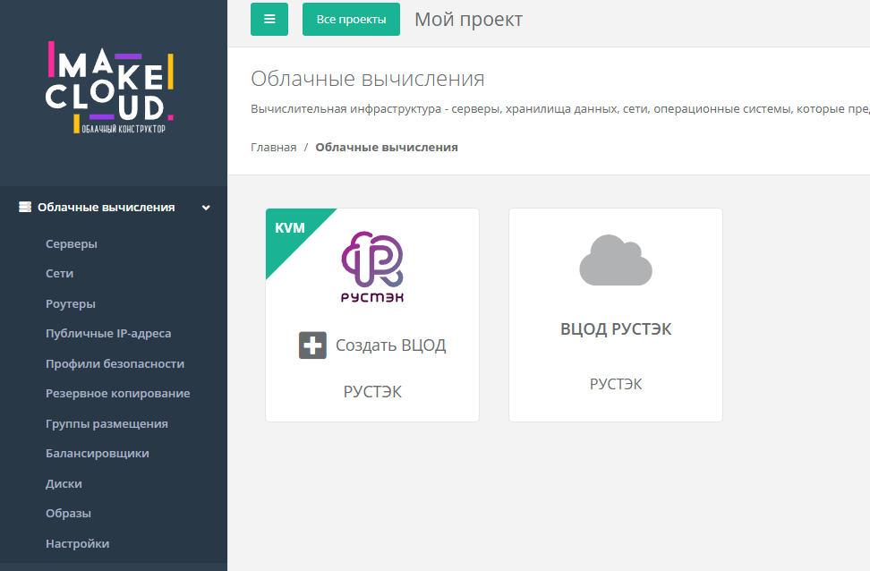

За сам факт существования ВЦОД сразу списалась **1 копейка**. В детализации эта операция называется «Обеспечение работы ВЦОД» и тарифицируется как **0,01 ₽ за единицу в день**.

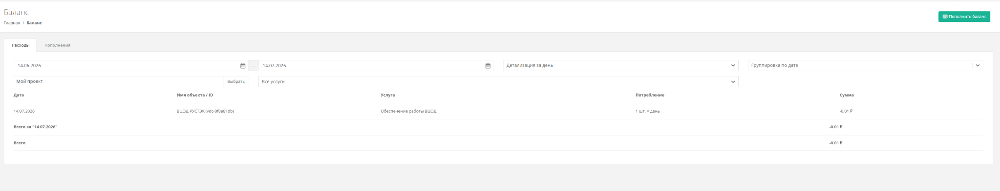

### Готовый тариф или конструктор

На странице серверов одновременно показаны готовые конфигурации от 149 ₽/мес и кнопка создания своего сервера.

При создании сервера можно:

- выбрать обычный образ ОС;
- выбрать готовый шаблон с программным обеспечением;
- настроить количество vCPU, объем RAM и размер диска;
- подключить или отключить публичный IPv4;
- добавить диски и сетевые подключения.

В конструкторе для точной конфигурации **1 vCPU / 1 ГБ RAM / 10 ГБ SSD** показано специальное предложение **4,97 ₽/день** вместе с IPv4. За 30 дней это **149,10 ₽**, то есть цена практически совпадает с готовым тарифом за 149 ₽/мес.

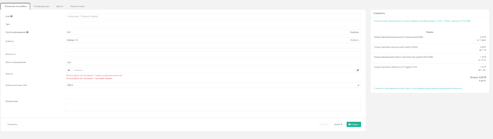

Кроме Linux и Windows доступны готовые образы с ПО: Docker, Forgejo, GitLab, Grafana + Loki, Grafana + Prometheus, LAMP, N8n, Nextcloud, Redmine, WikiJS, WordPress и другие. У каждого шаблона указаны минимальные требования.

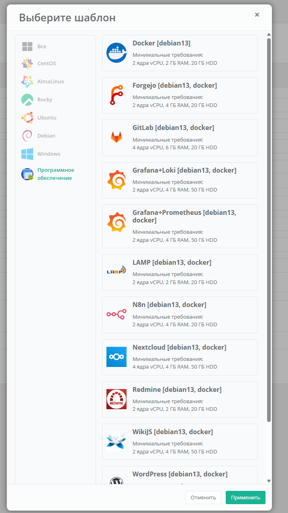

### Важная ловушка: 30 ГБ за 199 ₽, 31 ГБ — почти 900 ₽

Специальная цена привязана к точному набору ресурсов. Готовая конфигурация **1 vCPU / 2 ГБ RAM / 30 ГБ SSD** стоит **199 ₽/мес**. Если в конструкторе изменить диск всего на 1 ГБ и собрать **1 vCPU / 2 ГБ RAM / 31 ГБ SSD**, панель начинает считать все ресурсы отдельно:

| Ресурс | Цена в день |
| --- | ---: |
| 1 vCPU | 4,47 ₽ |
| 2 ГБ RAM | 7,36 ₽ |
| 31 ГБ SSD | 17,67 ₽ |
| 1 публичный IPv4 | 1,97 ₽ |
| **Итого с IPv4** | **31,47 ₽/день** |

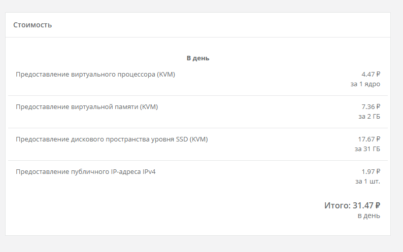

Получается:

- с публичным IPv4 — **31,47 × 30 = 944,10 ₽** за 30 дней;
- без публичного IPv4 — **29,50 × 30 = 885 ₽** за 30 дней;
- готовый тариф **1 / 2 / 30** — 199 ₽/мес.

То есть лишний 1 ГБ диска не просто добавляет стоимость гигабайта, а, судя по панели, снимает специальную цену со всей конфигурации. Разница с готовым тарифом достигает примерно **4,7 раза**. Перед созданием сервера нужно обязательно сверять блок «Стоимость», а для небольшого расширения диска иногда выгоднее взять отдельный дополнительный диск или следующий готовый тариф.

### Изменение конфигурации требует ручной остановки

Ресурсы работающего сервера изменить нельзя. При попытке увеличить RAM панель показывает ошибку: «Чтобы увеличить количество RAM вы должны выключить вашу ВМ».

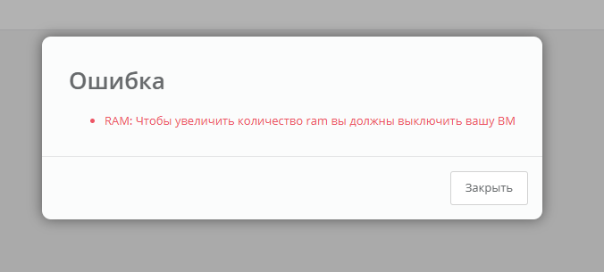

Порядок изменения конфигурации получился таким:

1. вручную выключить сервер;
2. выбрать новую конфигурацию и запустить изменение;
3. дождаться завершения обновления сервера;
4. вручную включить сервер.

Сам этап «Обновление сервера» занял около **20 секунд**. В интерфейсе отображается прогресс операции, но после ее завершения виртуальная машина сама не включилась.

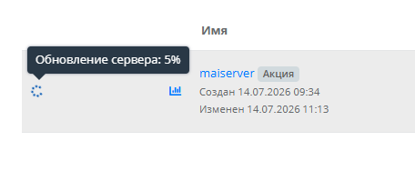

Это не hot resize: нужно заранее планировать перерыв в работе. Полный простой будет немного дольше 20 секунд, потому что к самой операции добавляются штатное выключение и последующая загрузка ОС.

В тесте тот же сервер был изменен с **1 vCPU / 1 ГБ RAM / 10 ГБ SSD** на **1 vCPU / 2 ГБ RAM / 30 ГБ SSD**. Данные и публичный IPv4 сохранились, а root-раздел после включения автоматически стал размером 30 ГБ — отдельно запускать `growpart` или `resize2fs` не пришлось.

### Публичные IP и приватная сеть

Для публичного IPv4 есть три режима:

- **Отключен** — сервер остается без публичного адреса;
- **Новый** — выделяется новый адрес из пула;
- **Случайный** — используется свободный адрес ВЦОД, а при его отсутствии создается новый пул адресов.

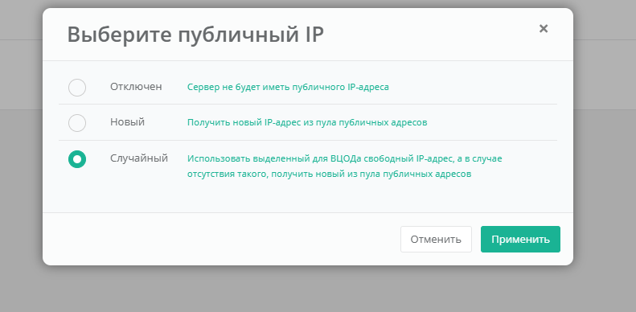

В тестовом ВЦОД виртуальный роутер был создан по умолчанию и отдельно не тарифицировался. При этом внутри Debian у сервера был только приватный адрес `10.0.1.4/24`, а маршрут по умолчанию шел через шлюз `10.0.1.1`. Публичный IPv4 на сетевом интерфейсе VM не отображался. Судя по этой конфигурации, внешний адрес подключается к серверу через виртуальный роутер как NAT/floating IP, а не назначается напрямую интерфейсу гостевой ОС.

Роутер и брандмауэр выполняют разные задачи. Маршрутизацию и трансляцию адресов обеспечивает роутер, а доступ фильтруют «Профили безопасности» в панели. В тесте SSH по TCP/22 и ответы на ping по ICMP по умолчанию были закрыты: для доступа пришлось добавить соответствующие входящие правила. [База знаний](https://kb.iteco.cloud/index/panel-upravleniya/pol-zovatelyam/shablony-brandmauera) также указывает, что шаблоны брандмауэра контролируют входящий и исходящий трафик и назначаются сетевому подключению сервера.

Это стоит учитывать при диагностике: порт должен быть разрешен и в профиле безопасности ВЦОД, и в брандмауэре самой ОС. Открывать SSH для всего интернета необязательно — безопаснее ограничить правило своим IP или VPN-подсетью.

Сервер при создании подключается к личной сети; ненужное подключение можно удалить. Также можно создать отдельную VLAN и объединить несколько серверов в локальную сеть. Это удобно, например, для связки веб-сервера и базы данных: БД можно оставить без публичного IPv4, повысив безопасность и сэкономив **1,97 ₽/день**, или около **59,10 ₽** за 30 дней.

Сама VLAN стоит **4,40 ₽/день**, то есть около **132 ₽** за 30 дней. Поэтому приватную сеть тоже нужно учитывать в общей цене и удалять, если она не используется.

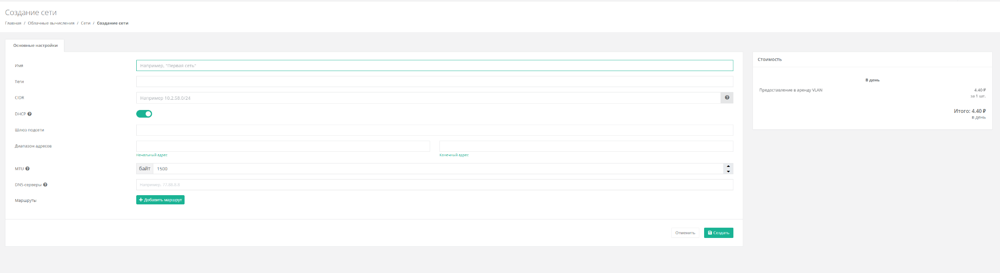

Расходы детализируются по объектам: отдельно видны ВЦОД, диск, vCPU, RAM и публичный IPv4. После создания тестовой конфигурации первые поминутные списания вместе с ВЦОД составили 2 копейки.

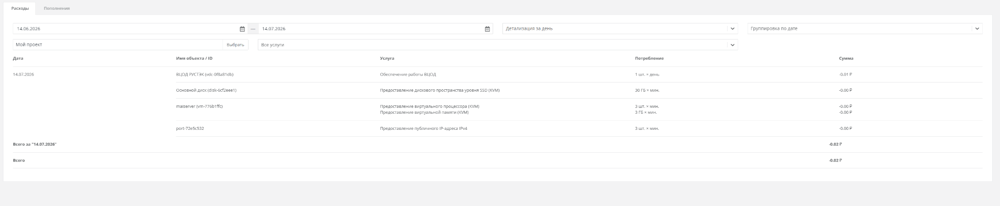

Баланс и детализация расходов обновляются примерно **раз в минуту**. Для диска, vCPU, RAM и публичного IPv4 панель накапливает потребление в формате «ресурс × минута», а рядом показывает уже списанную сумму. Поэтому изменение конфигурации или отключение ресурса отражается в расходах без ожидания конца часа или суток.

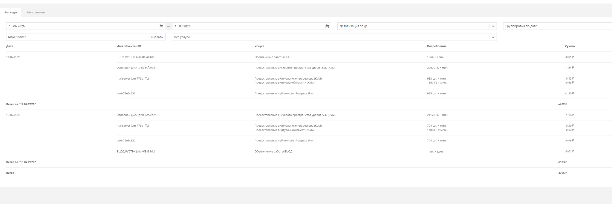

### Проверка техподдержки: ответ примерно за 45 минут

В поддержку был отправлен короткий запрос о размещении собственного почтового сервера и доступности почтовых портов. Обращение создано в личном кабинете в **11:49**, подтверждение регистрации пришло в **11:54**, а содержательный ответ — в **12:34**. Таким образом, первый ответ занял около **45 минут** от отправки запроса, или около 40 минут после письма о регистрации.

Необычная деталь: письмо о регистрации обращения пришло не от MakeCloud, а от **«Т1 Сервионика»** с адреса в домене `servionica.ru`. Содержательный ответ затем пришел уже с адреса поддержки MakeCloud. На момент проверки ответ был только в электронной почте: страница обращения в личном кабинете продолжала показывать исходный запрос без обновлений. Поэтому после обращения имеет смысл проверять почту, а не полагаться только на историю тикета в панели.

Кратко по ответу поддержки:

- собственный почтовый сервер на VPS размещать можно;
- входящий TCP/25 нужно разрешить в профиле безопасности ВЦОД и в брандмауэре VPS;
- исходящий TCP/25, по ответу поддержки, не закрыт и не блокируется;
- порты 465, 587, 993 и 4190 также нужно самостоятельно разрешить на обоих уровнях;
- PTR/rDNS можно настроить через поддержку, указав домен, IP-адрес и ресурс.

15 июля PTR-запись была отдельно запрошена ответом на это же письмо. Примерно через **1 час 53 минуты** поддержка сообщила, что запись добавлена. Это подтверждает, что настройка обратного DNS через поддержку действительно работает; адрес сервера, домен и остальные данные переписки здесь намеренно не публикуются.

Официальная статья [о переносе хостинга на MakeCloud](https://kb.iteco.cloud/index/panel-upravleniya/pol-zovatelyam/perenos-hostinga-na-platformu-makecloud-ru) подтверждает, что пользователь сам создает ВЦОД и VM, открывает необходимые порты в брандмауэре ВЦОД, а PTR-запись оформляется через поддержку. Это предварительно закрывает базовые технические вопросы для обычной почты, но доставляемость, репутацию выданного IPv4 и фактическую доступность TCP/25 снаружи все равно нужно проверять отдельно.

## Тест минимального VPS

14 июля 2026 года был протестирован сервер с конфигурацией, соответствующей минимальному готовому тарифу за 149 ₽/мес.

| Параметр | Результат |
| --- | --- |
| ОС | Debian GNU/Linux 13 (trixie) |
| Kernel во время теста | 6.12.74+deb13+1-amd64 |
| Виртуализация | KVM |
| CPU | Intel Core Processor (Broadwell, IBRS), 1 vCPU |
| RAM | 962 MiB |
| Диск | QEMU HARDDISK, 10 ГБ; root-раздел 9,7 ГБ |
| Публичный IPv4 | подключен |
| Глобальный IPv6 | отсутствовал |
| Внутренний адрес | сеть 10.0.1.0/24 |

Перед тестом были установлены все доступные обновления Debian. Обновление установило более новое ядро 6.12.95, но сервер до замеров не перезагружался, поэтому тесты выполнялись на исходном ядре 6.12.74.

### Важное уточнение про swap

Показанные в логе **2 ГБ swap не входят в тариф и не были подготовлены MakeCloud**. Swap-файл был вручную создан перед замерами с помощью скрипта из этого репозитория специально для безопасного запуска тестов на сервере с 1 ГБ RAM. Во время начала теста swap не использовался: **0 Б из 2 ГБ**.

### Сеть

Отдельный скрипт itdoginfo для российских iperf3-серверов показал:

| Город | Download | Upload | Ping |
| --- | ---: | ---: | ---: |
| Москва | 1034,6 Мбит/с | 1039,6 Мбит/с | 1 мс |
| Санкт-Петербург | 1026,5 Мбит/с | 1043,7 Мбит/с | 10 мс |
| Нижний Новгород | 1029,4 Мбит/с | 1041,8 Мбит/с | 7 мс |
| Челябинск | 1006,6 Мбит/с | 1030,7 Мбит/с | 23 мс |
| Тюмень | 957,3 Мбит/с | 980,2 Мбит/с | 33 мс |

Ручные 30-секундные проверки iperf3 в 5 потоков дали:

| Точка | Upload с VPS | Download на VPS |
| --- | ---: | ---: |
| Москва | 978 Мбит/с | 894 Мбит/с |
| Нижний Новгород | 980 Мбит/с | 867 Мбит/с |
| Тюмень | 899 Мбит/с | 901 Мбит/с |
| Нидерланды, Serverius | 175 Мбит/с | 897 Мбит/с |
| Франция, Париж | сервер был занят | сервер был занят |
| США, Калифорния | сервер был занят | сервер был занят |

Пинг без потерь на конечных точках:

| Точка | Средний ping |
| --- | ---: |
| Ya.ru | 3,9 мс |
| MTS Москва | 15,1 мс |
| 1.1.1.1 | 25,1 мс |

Сеть в коротком тесте оказалась намного быстрее заявленных на сайте 100 Мбит/с и фактически приблизилась к 1 Гбит/с по России. При этом на исходящих iperf3-тестах было много TCP retransmits: около 12 тысяч до Москвы, 9,5 тысячи до Нижнего Новгорода и 10,8 тысячи до Тюмени. Скорость высокая, но стабильность передачи под полной нагрузкой нужно повторно проверять в другое время суток и одним потоком.

### Диск

fio запускался с прямым вводом-выводом, файлом 4 ГБ и длительностью 30 секунд:

| Тест fio | Результат |
| --- | ---: |
| Последовательная запись, 1M, iodepth 16 | 732 MiB/s |
| Последовательное чтение, 1M, iodepth 16 | 717 MiB/s |
| Случайное чтение 4K, randrw 70/30, iodepth 32 | 17,8 тыс. IOPS, 69,6 MiB/s |
| Случайная запись 4K, randrw 70/30, iodepth 32 | 7649 IOPS, 29,9 MiB/s |

Для минимального сервера за 149 ₽/мес диск выглядит очень быстрым. Но это один короткий прогон на свежем VPS: для оценки стабильности нужны повторные замеры в часы нагрузки и тест после нескольких дней работы.

### CPU и память

| Тест sysbench | Результат |
| --- | ---: |
| CPU, 1 поток, первый прогон | 227,35 events/s |
| CPU, 1 поток, второй прогон | 233,95 events/s |
| Память, 1 поток, запись | 2857,31 MiB/s |

Два CPU-прогона отличаются примерно на 3%, что для короткого первичного теста выглядит нормально. Отдельный длительный мониторинг CPU steal в этом запуске не проводился.

### Краткий вывод по VPS

Минимальный сервер MakeCloud за 149 ₽/мес в первом тесте выглядит сильным по соотношению цены и производительности: около 1 Гбит/с по России, последовательный диск более 700 MiB/s и нормальная повторяемость короткого CPU-теста. Главные оговорки — большое число retransmits на исходящей сети, отсутствие глобального IPv6, только один тестовый сервер и короткая продолжительность замеров.

## Повторный тест после изменения на 1 / 2 / 30

После ручного изменения конфигурации тот же VPS был повторно протестирован как готовый тариф **1 vCPU / 2 ГБ RAM / 30 ГБ SSD за 199 ₽/мес**.

| Параметр | До изменения | После изменения |
| --- | ---: | ---: |
| vCPU | 1 | 1 |
| RAM | 962 MiB | 1,9 GiB |
| Root-раздел | 9,7 ГБ | 30 ГБ |
| Свободно на root перед тестом | 6,1 ГБ | 25 ГБ |
| Kernel | 6.12.74 | 6.12.95 |
| Ручной swap-файл | 2 ГБ, использовано 0 Б | 2 ГБ, использовано 0 Б |

Новый kernel активировался после обязательного выключения и последующего запуска сервера. Swap сохранился, но по-прежнему не использовался и не относится к ресурсам MakeCloud.

### Сравнение сети

Ручные 30-секундные тесты в 5 потоков остались примерно на том же уровне:

| Точка | 1 / 1 / 10 | 1 / 2 / 30 |
| --- | ---: | ---: |
| Москва, upload | 978 Мбит/с | 974 Мбит/с |
| Москва, download | 894 Мбит/с | 921 Мбит/с |
| Нижний Новгород, upload | 980 Мбит/с | 980 Мбит/с |
| Нижний Новгород, download | 867 Мбит/с | 876 Мбит/с |
| Тюмень, upload | 899 Мбит/с | 962 Мбит/с |
| Тюмень, download | 901 Мбит/с | 906 Мбит/с |

Быстрый автоматический тест отдельными короткими замерами показал от 1,0 до 1,9 Гбит/с по российским точкам, но для практической оценки лучше ориентироваться на более длинные ручные результаты: около 0,9–1,0 Гбит/с.

Большое число retransmits на исходящем трафике сохранилось: примерно 5,6 тысячи до Москвы, 10,4 тысячи до Нижнего Новгорода и 13,7 тысячи до Тюмени. Увеличение RAM не решило эту особенность сети.

Пинг до 1.1.1.1 и московской точки МТС практически не изменился: около 25,1 и 15,2 мс. Ya.ru во втором тесте разрешился в другой IP-адрес, поэтому рост с 3,9 до 18 мс нельзя напрямую связывать с изменением конфигурации.

### Сравнение диска, CPU и памяти

| Тест | 1 / 1 / 10 | 1 / 2 / 30 | Изменение |
| --- | ---: | ---: | ---: |
| Последовательная запись | 732 MiB/s | 785 MiB/s | +7% |
| Последовательное чтение | 717 MiB/s | 778 MiB/s | +9% |
| Случайное чтение 4K | 17,8 тыс. IOPS | 23,7 тыс. IOPS | +33% |
| Случайная запись 4K | 7,6 тыс. IOPS | 10,2 тыс. IOPS | +33% |
| CPU, среднее двух прогонов | 230,65 events/s | 245,76 events/s | +7% |
| Память, запись | 2857 MiB/s | 3128 MiB/s | +9% |

Результаты второго запуска лучше, но CPU остался тем же, а увеличение RAM само по себе не должно ускорять диск и однопоточный CPU-тест. Разницу разумнее считать обычным разбросом между прогонами, влиянием перезагрузки и нового kernel либо текущей нагрузкой на хост-узел, а не гарантированным эффектом перехода на тариф за 199 ₽.

### Вывод после изменения конфигурации

Resize отработал корректно: данные и IPv4 сохранились, RAM увеличилась до 2 ГБ, диск и root-раздел — до 30 ГБ. Производительность не ухудшилась. Главный минус процесса — отсутствие горячего изменения и автоматического запуска: сервер нужно вручную выключить, дождаться обновления и затем вручную включить.

## Кто стоит за проектом

Юридическое лицо - **ООО «СБКЛАУД»** ([ИНН 7703768575](https://zachestnyibiznes.ru/company/ul/1127746395303_7703768575_OOO-SBKLAUD), ОГРН 1127746395303), зарегистрировано 23 мая 2012 года в Москве. Юридический адрес: Ленинский проспект, д. 42, корп. 6, помещ. II, комн. 16. Генеральный директор с 22 апреля 2021 года - Лопаткин Константин Александрович. На сайте указана лицензия связи № 184119.

По данным [hosting101.ru](https://hosting101.ru/makecloud.ru), проект основан на облачной платформе OpenStack и исторически связывался с компанией «Сервионика» (бывшее подразделение «Ай-Теко»). При этом сам MakeCloud работает как отдельный бренд ООО «СБКЛАУД», а не как прямой продукт этих компаний.

## Что заявлено на сайте

На главной странице [MakeCloud](https://lk.makecloud.ru/register?ref_code=730843a1be5f4d099c0b) представлены три направления: виртуальные серверы, S3-хранилище и Kubernetes.

### Виртуальные серверы

Серверы с моментальной активацией:

| Тариф | CPU | RAM | SSD | Цена в месяц |
| --- | --- | --- | --- | --- |
| VPS 1 | 1 Core | 1 ГБ | 10 ГБ | 149 ₽ |
| VPS 2 | 1 Core | 2 ГБ | 30 ГБ | 199 ₽ |
| VPS 3 | 2 Core | 4 ГБ | 60 ГБ | 380 ₽ |
| VPS 4 | 4 Core | 8 ГБ | 80 ГБ | 730 ₽ |

HighLoad-серверы:

| Тариф | CPU | RAM | SSD | Цена в месяц |
| --- | --- | --- | --- | --- |
| HighLoad 1 | 4 Core | 8 ГБ | 120 ГБ | 1330 ₽ |
| HighLoad 2 | 8 Core | 16 ГБ | 160 ГБ | 1820 ₽ |

В каждый тариф включены 1 IPv4-адрес и безлимитный трафик. В разделе «Гарантии» заявлен интернет-канал до 100 Мбит/с без ограничения по трафику. Локальная сеть - 10 Гбит/с. Windows Server 2012/2016/2019 - отдельно, от 210 руб/месяц (минимум 2 ГБ RAM, 2 CPU).

Готовые образы в один клик: Docker, GitLab, WikiJS, Forgejo, NextCloud, N8n, Grafana + Loki, Grafana + Prometheus.

### Хранилище S3

В кабинете S3 создается отдельным ресурсом. На 14 июля 2026 года интерфейс показывал цену **0,08 ₽ за 1 ГБ в день**.

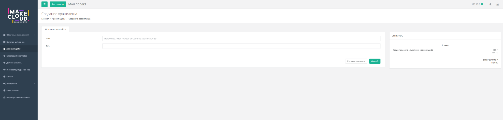

Масштабируемое объектное хранилище. Заявленные характеристики:

- стандартный размер хранилища - 5 ТБ, расширение по запросу;
- максимальный размер одного объекта - 5 ТБ;
- 3 резервные копии каждого файла;
- несколько объектных пространств с отдельными ключами доступа.

### Kubernetes

Управляемый Kubernetes. Заявленные возможности:

- выбор версий;
- веб-панель Kubernetes Dashboard;
- зеркало реестра образов;
- конвейеры CI/CD;
- отказоустойчивые кластеры с резервированием мастера;
- сертификат 152-ФЗ.

### Гарантии и цифры

| Параметр | Значение |
| --- | --- |
| SLA Аптайм | 99,95% |
| Пользователей | 112 тысяч |
| Серверов создано | 337 тысяч |
| Лет на рынке | с 2010 года |
| Возврат средств | если сайт недоступен более 40 минут за месяц |
| Тарификация | ежедневная |
| Минимальное пополнение | 100 руб. |
| Дата-центр | собственный, Tier III, Москва |

Заявлено оборудование Cisco, Huawei, Intel. Адрес поддержки - `support@makecloud.ru`, телефон +7 (499) 750-03-74.

## Публичные отзывы

Помимо короткого теста личного кабинета, по открытым источникам картина по MakeCloud сложилась довольно противоречивая. Ниже сводка с нескольких площадок.

### hosting101.ru - 3,3 из 5, 12 отзывов

На [странице MakeCloud на hosting101.ru](https://hosting101.ru/makecloud.ru) собрано 12 отзывов со средним баллом 3,3 из 5. За пять лет проголосовало 141 человек.

Что пишут как плюсы (по голосованию за преимущества):

- неделя бесплатного теста - 29%;
- доступные большие мощности - 21%;
- удобная админка - 18%;
- оплата по потреблению - 17%;
- шаблоны серверов - 14%;
- отзывчивая техподдержка - 11%.

Что пишут как минусы (по голосованию за недостатки):

- «падает и не доступен» - 21%;
- «подключался на акционный тариф» - 18%;
- «маловато памяти дают» - 13%;
- «техподдержка не работает вечером и по выходным» - 13%;
- «долго отвечает техподдержка, примерно 6-8 часов» - 11%;
- «теста нет, только видимость» - 11%;
- «для тестового периода звонят на телефон» - 9%;
- «поддержка не отвечает» - 9%;
- «часто не пускает по SSH» - 9%;
- «не возвращают деньги за неоказанные услуги, хотя поддержка обещала» - 8%;
- «постоянно падает» - 6%.

Отдельные конкретные отзывы:

- **Олег13 (4 октября 2025):** пользуется VPS около 1,5 лет, цену не повышают - это плюс, но техподдержку нельзя назвать быстрой, «иногда и не совсем дружелюбное отношение налицо». В целом опыт положительный.
- **Гость (8 февраля 2025):** «аптайм хороший, сеть быстрая, но в поддержке сидят полные идиоты». На втором сервере `steal time` достигал 70%, три дня без внятного ответа поддержки.
- **Ezhik (12 октября 2024):** «ужасный провайдер, те цены что указаны это акционные сервера, которые обрезаны в использовании», просил возврат средств.
- **Term1na (30 ноября 2023):** жалоба на панель управления и на то, что для удаления учётной записи нужно заполнять заявление с паспортными данными.
- **Phil (22 января 2023):** год держал два акционных сервера по 59 руб/мес, всё работало, но внезапно оба сервера отключили без объяснения причин, аккаунт заблокировали при положительном балансе, на письма не отвечали два дня, по телефону ничем помочь не смогли.
- **Павел Васильевич К. (18 февраля 2022):** «заказал, оплатил. Цена неплохая. Но хостинг заблокировали без объяснения причин. Ссылаются на пункт 7.4, пытаюсь выяснить подробности - тишина, ну и деньги сгорели».
- **SPe (15 января 2022):** «крайне не рекомендую. В случае сбоев с их стороны никаких компенсаций не предусмотрено».

### hostings.info - рейтинг 2,6, 2 отзыва

На [странице MakeCloud на hostings.info](https://ru.hostings.info/makecloud-ru.html) общий рейтинг от пользователей - 2,6. Плюсы: «всё устраивает» и «цена хорошая». Минусы: «бывают проблемы», «неудовлетворительно», «надёжность плохая».

Из двух конкретных отзывов:

- **Олег (4 октября 2025, проверен):** совпадает с отзывом на hosting101 - фиксированные цены как плюс, медленная и не всегда дружелюбная поддержка как минус.
- **Ихтиёр Раупов (19 февраля 2024):** жалоба на подключение через удалённое соединение и постоянные предупреждения при переходе по страницам.

### sohost.ru и gembla.net - жалоба на тарифы

На [sohost.ru](https://sohost.ru/makecloud.ru/) зафиксирован аптайм 99,98% и один отзыв. На [gembla.net](https://gembla.net/makecloud) рейтинг 2,67, тоже один отзыв.

В обоих местах фигурирует одна и та же жалоба (vrnexpert, 20 ноября 2025): приобрёл самый дешёвый тариф на 3 месяца, через 25 дней средства полностью списались за непонятные услуги, хотя ежедневное списание должно было быть 5 рублей, а фактически нарастающим итогом доходило до 30 руб. «Стоимость тарифов по факту не соответствует действительности».

## Что проверить

После первого теста остаются конкретные зоны риска, которые нужно проверять более длительно:

- **Стабильность сети.** Первый тест показал около 1 Гбит/с по России, но много retransmits на исходящих направлениях и заметно более слабый upload до Нидерландов. Нужны повторные замеры в разное время суток, одним и несколькими потоками.
- **Стабильность `steal time`.** Есть отзыв про 70% `steal time` на новом сервере - это признак перегруженной ноды гипервизора.
- **Поведение поддержки при инцидентах.** На предварительный вопрос ответили примерно за 45 минут, но большинство негативных отзывов относятся к более сложным инцидентам и невозможности решить проблему. Скорость и качество ответа при реальном сбое еще не проверены.
- **Синхронизация тикетов.** Ответ поддержки пришел по электронной почте, но не появился на странице обращения в личном кабинете. При работе с тикетами нужно контролировать оба канала.
- **Сетевые правила по умолчанию.** SSH и ICMP нужно открыть в профиле безопасности; для рабочих серверов следует заранее подготовить минимальный набор правил и ограничить административный доступ доверенными адресами.
- **Почтовые ограничения.** Поддержка сообщила, что исходящий TCP/25 не блокируется, и добавила запрошенную PTR-запись примерно за 1 час 53 минуты. Перед переносом почты нужно самостоятельно проверить обратную запись через `dig -x`, соединение с внешними MX, репутацию IPv4 и доставляемость в основные почтовые сервисы.
- **Условия акционных тарифов.** Несколько жалоб на блокировку или ограничения акционных серверов без объяснений (ссылка на пункт 7.4 оферты). Перед покупкой акции имеет смысл прочитать этот пункт.
- **Граница специального тарифа.** Проверить, сохраняется ли цена готового тарифа при изменении диска, RAM или CPU. В тесте переход с 30 на 31 ГБ SSD для конфигурации 1/2 переключил весь сервер на дорогую ресурсную тарификацию.
- **Простой при изменении ресурсов.** Resize требует вручную выключить сервер и после обновления вручную включить его. Для рабочего проекта нужно планировать окно обслуживания.
- **Прозрачность списаний.** Есть жалоба на непропорциональное списание средств при ежедневной тарификации. После создания сервера нужно несколько дней сверять поминутную детализацию по vCPU, RAM, дискам, IPv4, ВЦОД и VLAN.
- **Удаление зависимых ресурсов.** При удалении сервера отдельно проверить и удалить ненужные диски, публичные IP, сети и сам ВЦОД, чтобы они не продолжили тарифицироваться.
- **Процедура удаления аккаунта.** Для удаления учётной записи allegedly нужно заявление с паспортными данными - это стоит уточнить заранее.
- **Реальные локации.** Заявлен собственный дата-центр в Москве, но на других площадках MakeCloud связывают с инфраструктурой «Сервионики» / «Ай-Теко» - стоит проверить через `mtr` и `whois`.
- **Сертификат 152-ФЗ.** Для Kubernetes на сайте заявлен сертификат 152-ФЗ; для обычных VPS этот вопрос нужно уточнять через поддержку.

## Итог

После проверки кабинета и минимального VPS MakeCloud выглядит интересным бюджетным облаком. Сервер за 149 ₽/мес в коротком тесте дал около 1 Гбит/с по России, более 700 MiB/s на последовательных операциях с диском и 17,8/7,6 тыс. IOPS в смешанном 4K-тесте. Это сильный результат для такой цены.

Главный ценовой риск — конструктор: даже небольшое отклонение от готовой конфигурации может отключить специальную цену и увеличить месячную стоимость в несколько раз. По производительности остаются вопросы к большому числу retransmits на исходящей сети и стабильности результатов во времени. На простой вопрос поддержка ответила примерно за 45 минут, но ответ отобразился только в почте, а не в личном кабинете. Публичные отзывы по-прежнему добавляют вопросы к обработке сложных инцидентов и прозрачности списаний. Перед переносом рабочего проекта стоит оставить сервер под мониторингом на несколько дней, повторить сеть, диск и CPU в часы нагрузки и контролировать детализацию расходов.

Изменение ресурсов работает, но требует простоя: сервер нужно вручную выключить, дождаться обновления и вручную включить. В тесте переход с тарифа 1/1/10 на 1/2/30 занял около 20 секунд на этапе обновления, сохранил данные и IPv4 и автоматически расширил root-раздел.

## Источники

- [MakeCloud - регистрация по реферальной ссылке](https://lk.makecloud.ru/register?ref_code=730843a1be5f4d099c0b)
- [Перенос хостинга на платформу MakeCloud — база знаний](https://kb.iteco.cloud/index/panel-upravleniya/pol-zovatelyam/perenos-hostinga-na-platformu-makecloud-ru)
- [Шаблоны брандмауэра MakeCloud — база знаний](https://kb.iteco.cloud/index/panel-upravleniya/pol-zovatelyam/shablony-brandmauera)
- [Создание пользовательского шаблона брандмауэра — база знаний](https://kb.iteco.cloud/index/panel-upravleniya/pol-zovatelyam/kak-sozdat-pol-zovatel-skij-shablon-brandmauera)
- [MakeCloud на hosting101.ru - 12 отзывов, рейтинг 3,3](https://hosting101.ru/makecloud.ru)
- [MakeCloud на hostings.info - 2 отзыва, рейтинг 2,6](https://ru.hostings.info/makecloud-ru.html)
- [MakeCloud на sohost.ru - аптайм 99,98%](https://sohost.ru/makecloud.ru/)
- [MakeCloud на gembla.net - рейтинг 2,67](https://gembla.net/makecloud)
- [ООО «СБКЛАУД» - карточка на За честный бизнес](https://zachestnyibiznes.ru/company/ul/1127746395303_7703768575_OOO-SBKLAUD)
- Личный тест VPS MakeCloud от 14 июля 2026 года
- Повторный тест того же VPS после изменения конфигурации на 1 vCPU / 2 ГБ RAM / 30 ГБ SSD
