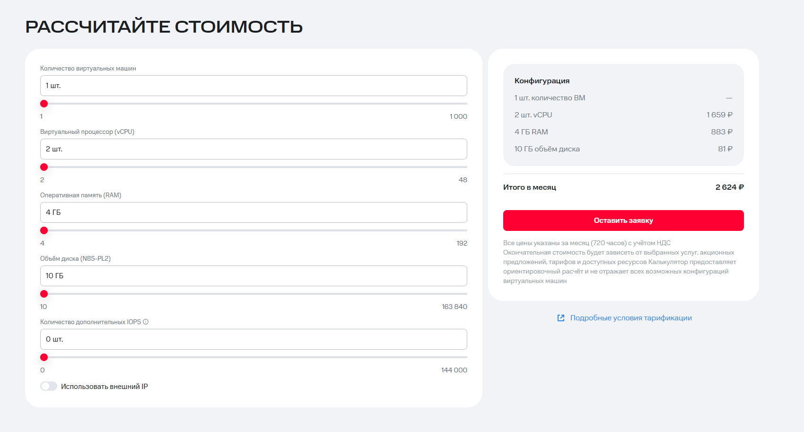

# MWS

[MWS](https://mws.ru/) (MTS Web Services) - облачные, ИИ- и платформенные сервисы группы МТС. В контексте VPS это не классический дешёвый VDS-провайдер, а крупное российское облако, которое стоит смотреть отдельно.

## Статус заметки

Личного теста виртуальной машины пока нет. Заметка добавлена как **кандидат на тест** по сайту, документации и переданному скриншоту калькулятора.

Главный вывод: MWS выглядит интересным вариантом для российских проектов, где важны крупный провайдер, документация, статусная страница и облачная экосистема. Для простого дешевого VPS цена стартовой конфигурации выше, чем у бюджетных VDS.

## Скриншот калькулятора

На переданном скриншоте выбран вариант:

- 1 виртуальная машина;
- 2 vCPU;
- 4 ГБ RAM;
- 10 ГБ диска NBS-PL2;
- 0 дополнительных IOPS;
- внешний IP выключен.

Итог в калькуляторе - **2 624 ₽ в месяц**. По текущей документации MWS Cloud Platform это хорошо сходится с помесячными ценами Compute из расчета 720 часов: 2 vCPU по 829,65 ₽, 4 ГБ RAM по 220,83 ₽ и 10 ГБ NBS-PL2 по 8,17 ₽.

Важная оговорка: на скриншоте внешний IP выключен. В документации MWS Cloud Platform активный внешний IP тарифицируется отдельно, как и исходящий внешний трафик. Поэтому для реального VPS с публичным доступом итоговую цену нужно считать с IP, трафиком, бэкапами и возможными снимками.

## Что заявлено

У MWS есть несколько облачных направлений, поэтому важно не смешивать разные продуктовые линейки. Для скриншота релевантнее выглядит **MWS Cloud Platform Compute**, где отдельно тарифицируются vCPU, RAM, диск NBS-PL2, IOPS, бэкапы и образы.

По публичной документации MWS Cloud Platform:

- цена за месяц формируется из 720 часов использования;
- Compute тарифицирует RAM, vCPU, объем диска NBS-PL2, дополнительные IOPS, резервные копии и образы;
- Virtual Private Cloud отдельно тарифицирует активный внешний IP, неактивный внешний IP, NAT-шлюз и исходящий трафик;
- в документации Cloud Platform указаны 1 регион `ru-central1` и 2 зоны доступности `ru-central1-a`, `ru-central1-b`;
- есть отдельная страница статуса сервисов с общим статусом, мониторингом и списком инцидентов;
- обращения в поддержку можно направлять через платформу, email `support@mws.ru`, телефон 8-800-250-10-01 и клиентский портал ITSM.

Отдельная страница виртуальной инфраструктуры MWS описывает более enterprise-сценарий с облаком, поддержкой 24/7, доступностью 99,99% и несколькими зонами доступности. Для обычной покупки небольшой VM нужно смотреть, какой именно продукт используется: MWS Cloud Platform Compute или виртуальная инфраструктура на базе VMware.

## Быстрая проверка

Проверка 3 июля 2026 года из текущей сети:

- `https://mws.ru/` открылся с HTTP 200 примерно за 0,74 секунды;
- в ответе главной страницы видны `Server: QRATOR` и `x-powered-by: Nuxt`;
- новый сервер не создавался, тестов сети, диска и поддержки пока нет.

## Плюсы

- крупный российский провайдер из экосистемы МТС;
- есть публичная документация по тарифам, регионам, статусу сервисов и правилам поддержки;
- тарифная модель прозрачная для облака: отдельно видны vCPU, RAM, диск, IOPS, IP и трафик;
- есть статусная страница и формализованные правила обработки обращений;
- подходит для проектов, где важны российская инфраструктура, документы и предсказуемая облачная модель.

## Минусы и риски

- это не бюджетный VPS: конфигурация 2 vCPU / 4 ГБ RAM / 10 ГБ диска уже около 2 624 ₽/мес без внешнего IP;
- внешний IP, исходящий трафик, бэкапы, образы и дополнительные IOPS нужно считать отдельно;
- Cloud Platform и VMware-виртуальная инфраструктура выглядят как разные продуктовые контуры, поэтому перед заказом нужно точно понимать, какой сервис выбран;
- по MWS пока нет личного теста VM, панели, оплаты и поддержки;
- для маленьких пет-проектов может быть избыточно по цене и сложности.

## Что тестировать перед рекомендацией

- можно ли удобно зарегистрироваться и оплатить нужный сервис под свой тип клиента;
- итоговую цену минимальной VM с публичным IP, трафиком, бэкапами и снапшотами;
- доступные образы ОС, скорость создания и удаления VM;
- задержку и маршруты до целевой аудитории;
- диск NBS-PL2: последовательное чтение/запись и 4K randrw;
- CPU steal и стабильность производительности под нагрузкой;
- правила SMTP, PTR, антиабуза, DDoS и замены проблемного IP;
- реакцию поддержки на простой технический вопрос до покупки и после создания VM;
- как статусная страница отражает реальные инциденты.

## Итог

MWS стоит добавить в список кандидатов на тест как крупное российское облако, а не как дешёвый VPS. По калькулятору и документации стартовая цена выше бюджетных VDS, зато есть сильные признаки enterprise-провайдера: документация, статусная страница, поддержка и отдельная тарификация облачных ресурсов.

До рекомендации нужен практический тест: создать VM, включить внешний IP, прогнать сеть/диск/CPU и проверить поддержку.

## Источники

- [MWS](https://mws.ru/)
- [MWS Cloud Platform: тарификация сервисов](https://mws.ru/docs/cloud-platform/about/general/mws-cloud-platform-pricing.html)
- [MWS Cloud Platform: регионы и зоны доступности](https://mws.ru/docs/cloud-platform/about/general/regions-and-zones.html)
- [MWS Cloud Platform: статус работы сервисов](https://mws.ru/docs/cloud-platform/about/general/service-status.html)
- [MWS: правила взаимодействия со службой технической поддержки](https://mws.ru/docs/docum/hub_technicalregulations.html)
- [MWS: виртуальная инфраструктура](https://mws.ru/services/virtual-infrastructure/)
- Переданный скриншот калькулятора MWS
