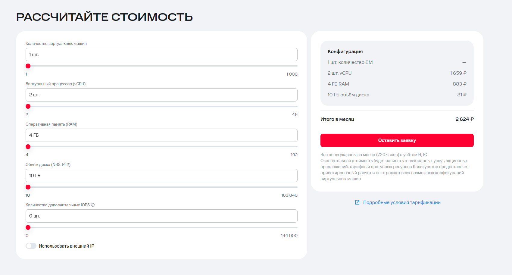

# MWS

[MWS](https://mws.ru/) (MTS Web Services) — облачные, ИИ- и платформенные сервисы группы МТС. В контексте VPS это не классический дешёвый VDS-провайдер, а крупное российское облако, которое стоит смотреть отдельно.

## Статус заметки

Личного теста виртуальной машины пока нет. Заметка добавлена как **кандидат на тест** по сайту, документации и переданному скриншоту калькулятора.

Главный вывод: MWS выглядит интересным вариантом для российских проектов, где важны крупный провайдер, документация, статусная страница и облачная экосистема. Для простого дешёвого VPS стартовая конфигурация заметно дороже бюджетных VDS, а итог нужно считать вместе с публичным IP, трафиком, резервными копиями, логами и сопутствующими сервисами.

Последняя проверка тарифов: **25 августа 2026 года**.

## Скриншот калькулятора и изменение цен Compute

На переданном ранее скриншоте выбран вариант:

- 1 виртуальная машина;
- 2 vCPU;
- 4 ГБ RAM;
- 10 ГБ диска NBS-PL2;
- 0 дополнительных IOPS;
- внешний IP выключен.

На скриншоте итог составляет **2 624 ₽ в месяц**. Этот расчёт соответствовал тарифам до 1 августа 2026 года: 2 vCPU по 829,65 ₽, 4 ГБ RAM по 220,83 ₽ и 10 ГБ NBS-PL2 по 8,17 ₽.

С 1 августа в документации Compute появились отдельные категории `base` и `general`, а цены изменились:

| Ресурс | `base`, ₽/мес | `general`, ₽/мес |
| --- | ---: | ---: |
| 1 vCPU | 821,376 | 912,528 |
| 1 ГБ RAM | 230,688 | 242,856 |
| 1 ГБ NBS-PL2 | 8,928 | 8,928 |

Для той же конфигурации 2 vCPU / 4 ГБ RAM / 10 ГБ NBS-PL2 получается:

| Категория VM | vCPU | RAM | Диск | Итого без внешнего IP |
| --- | ---: | ---: | ---: | ---: |
| `base` | 1 642,752 ₽ | 922,752 ₽ | 89,280 ₽ | **2 654,784 ₽/мес** |
| `general` | 1 825,056 ₽ | 971,424 ₽ | 89,280 ₽ | **2 885,760 ₽/мес** |

Активный внешний IP стоит ещё **152,49 ₽/мес**. Поэтому ориентир для публично доступной VM без учёта исходящего трафика и бэкапов составляет:

- `base`: около **2 807,27 ₽/мес**;
- `general`: около **3 038,25 ₽/мес**.

Категорию ресурсов нужно проверять в выбранной конфигурации панели: старый скриншот не показывает разделение на `base` и `general`. Нельзя автоматически считать, что любой прежний flavor относится к более дешёвой категории.

## Artifact Registry: GA и платная тарификация с 24 августа

С **24 августа 2026 года** MWS Cloud Platform Artifact Registry перешёл из Preview в General Availability и начал тарифицироваться.

Актуальные ставки с НДС 22%:

| Параметр | Единица | Цена |
| --- | --- | ---: |
| Хранение артефактов | 1 ГБ в месяц | **3,672 ₽** |
| Исходящий трафик | 1 ГБ | **1,32 ₽** |

Практически это означает, что container registry больше нельзя считать бесплатным preview-компонентом. Для CI/CD нужно отдельно оценить:

- суммарный размер Docker-образов и других артефактов;
- число сохраняемых тегов и старых версий;
- lifecycle/cleanup policy;
- трафик при развёртывании образов в других сетях или площадках;
- стоимость повторных загрузок больших слоёв;
- резервный способ получить критичный образ при проблемах registry.

Для небольшого проекта стоимость хранения обычно невелика, но без очистки старых image tags объём может расти незаметно.

## Audit Logs: тарификация с 1 сентября

На 25 августа Audit Logs ещё указан как Preview без тарификации, но документация предупреждает: с **1 сентября 2026 года** сервис станет платным.

| Параметр | Единица | Цена с НДС 22% |
| --- | --- | ---: |
| Объём данных в хранилище | ГБ·час | **0,0732 ₽** |
| Экспорт событий | 1 000 событий | **0,3556 ₽** |

Единица хранения — именно **ГБ·час**, а не ГБ в месяц. Перед включением долгого retention полезно оценить средний объём логов и срок хранения, иначе audit trail может стать заметной отдельной статьёй расходов.

Что проверить до 1 сентября:

- какие сервисы и действия генерируют события;
- включён ли сбор там, где он действительно нужен;
- срок хранения;
- фильтрацию шумных событий;
- объём экспорта в SIEM или внешнее хранилище;
- оповещения по расходам;
- требования законодательства и внутренних политик к audit trail.

Отключать аудит только ради экономии для production-системы опасно. Корректнее управлять охватом, retention и экспортом.

## Что заявлено

У MWS есть несколько облачных направлений, поэтому важно не смешивать разные продуктовые линейки. Для скриншота релевантнее **MWS Cloud Platform Compute**, где отдельно тарифицируются vCPU, RAM, диск NBS-PL2, IOPS, бэкапы и образы.

По публичной документации MWS Cloud Platform:

- цена за месяц формируется из 720 часов использования;
- Compute разделяет ресурсы VM на категории `base` и `general`;
- отдельно тарифицируются RAM, vCPU, объём диска NBS-PL2, дополнительные IOPS, резервные копии и образы;
- Virtual Private Cloud отдельно тарифицирует активный внешний IP, неактивный внешний IP, NAT-шлюз и исходящий трафик;
- в документации Cloud Platform указаны 1 регион `ru-central1` и 2 зоны доступности `ru-central1-a`, `ru-central1-b`;
- есть отдельная страница статуса сервисов с общим статусом, мониторингом и списком инцидентов;
- обращения в поддержку можно направлять через платформу, email `support@mws.ru`, телефон 8-800-250-10-01 и клиентский портал ITSM.

Отдельная страница виртуальной инфраструктуры MWS описывает enterprise-сценарий с облаком, поддержкой 24/7, доступностью 99,99% и несколькими зонами доступности. Для обычной покупки небольшой VM нужно смотреть, какой именно продукт используется: MWS Cloud Platform Compute или виртуальная инфраструктура на базе VMware.

## Быстрая проверка

Проверка 3 июля 2026 года из текущей сети:

- `https://mws.ru/` открылся с HTTP 200 примерно за 0,74 секунды;
- в ответе главной страницы видны `Server: QRATOR` и `x-powered-by: Nuxt`;
- новый сервер не создавался, тестов сети, диска и поддержки пока нет.

## Плюсы

- крупный российский провайдер из экосистемы МТС;
- есть публичная документация по тарифам, регионам, статусу сервисов и правилам поддержки;
- тарифная модель прозрачная для облака: отдельно видны vCPU, RAM, диск, IOPS, IP и трафик;
- Artifact Registry перешёл в GA;
- есть статусная страница и формализованные правила обработки обращений;
- подходит для проектов, где важны российская инфраструктура, документы и предсказуемая облачная модель.

## Минусы и риски

- это не бюджетный VPS: конфигурация 2 vCPU / 4 ГБ RAM / 10 ГБ диска теперь стоит примерно 2 655–2 886 ₽/мес без внешнего IP;
- внешний IP, исходящий трафик, бэкапы, образы и дополнительные IOPS нужно считать отдельно;
- после GA Artifact Registry тарифицирует хранение и исходящий трафик;
- с 1 сентября Audit Logs создаёт отдельные расходы на хранение и экспорт событий;
- Cloud Platform и VMware-виртуальная инфраструктура выглядят как разные продуктовые контуры, поэтому перед заказом нужно точно понимать, какой сервис выбран;
- по MWS пока нет личного теста VM, панели, оплаты и поддержки;
- для маленьких пет-проектов платформа может быть избыточна по цене и сложности.

## Что тестировать перед рекомендацией

- можно ли удобно зарегистрироваться и оплатить нужный сервис под свой тип клиента;
- итоговую цену минимальной VM с публичным IP, трафиком, бэкапами и снапшотами;
- различия категорий Compute `base` и `general` в доступных flavors;
- доступные образы ОС, скорость создания и удаления VM;
- задержку и маршруты до целевой аудитории;
- диск NBS-PL2: последовательное чтение/запись и 4K randrw;
- CPU steal и стабильность производительности под нагрузкой;
- правила SMTP, PTR, антиабуза, DDoS и замены проблемного IP;
- Artifact Registry: скорость push/pull, cleanup старых образов и фактический трафик;
- Audit Logs: реальный объём событий, retention и экспорт;
- реакцию поддержки на простой технический вопрос до покупки и после создания VM;
- как статусная страница отражает реальные инциденты.

## Итог

MWS остаётся кандидатом на тест как крупное российское облако, а не как дешёвый VPS. Августовское обновление делает карточку практичнее: старый расчёт 2 624 ₽ уже нельзя использовать как текущую цену, Artifact Registry стал платным GA-сервисом, а с 1 сентября начнётся тарификация Audit Logs.

Категорию повышать рано. До рекомендации нужен практический тест: создать VM, определить фактическую категорию ресурсов, включить внешний IP, прогнать сеть/диск/CPU, проверить поддержку и сравнить счёт с расчётом.

## Источники

- [MWS](https://mws.ru/)
- [MWS Cloud Platform: тарификация сервисов](https://mws.ru/docs/cloud-platform/about/general/mws-cloud-platform-pricing.html)
- [MWS Cloud Platform: Artifact Registry](https://mws.ru/docs/cloud-platform/registry.html)
- [Специальные условия MWS Cloud Platform Artifact Registry от 24 августа 2026 года](https://mws.ru/docs/docum/cloud_terms_mws_registry.html)
- [MWS Cloud Platform: Audit Logs](https://mws.ru/docs/cloud-platform/audit-logs.html)
- [MWS Cloud Platform: регионы и зоны доступности](https://mws.ru/docs/cloud-platform/about/general/regions-and-zones.html)
- [MWS Cloud Platform: статус работы сервисов](https://mws.ru/docs/cloud-platform/about/general/service-status.html)
- [MWS: правила взаимодействия со службой технической поддержки](https://mws.ru/docs/docum/hub_technicalregulations.html)
- [MWS: виртуальная инфраструктура](https://mws.ru/services/virtual-infrastructure/)
- Переданный скриншот калькулятора MWS
