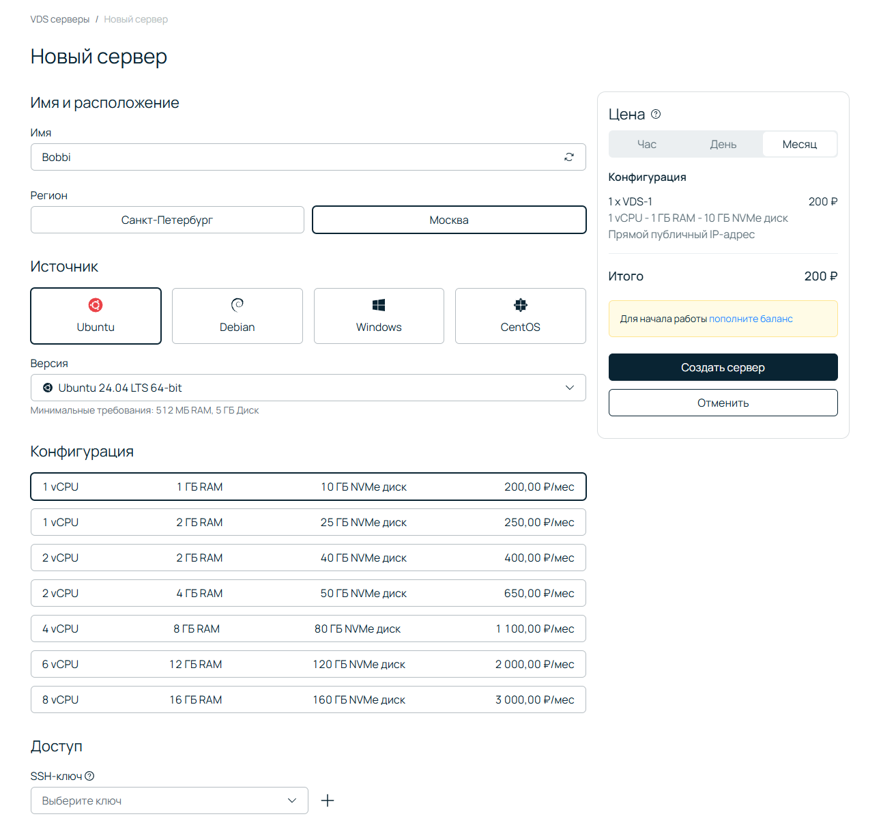
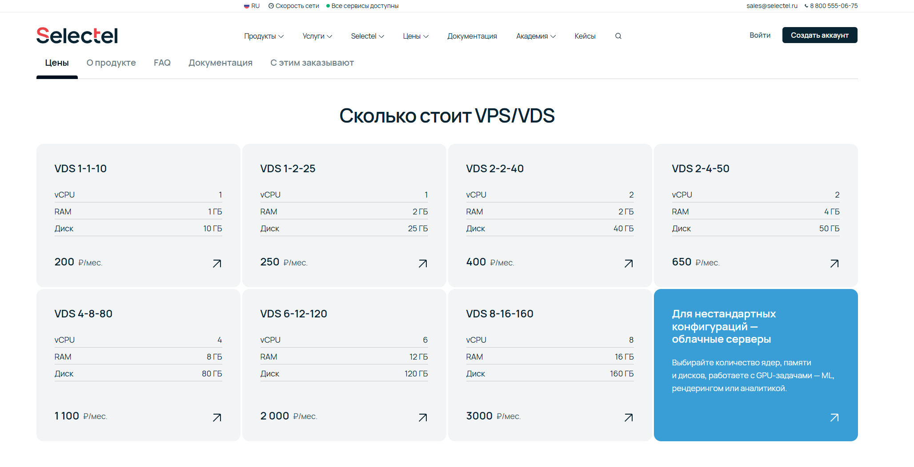
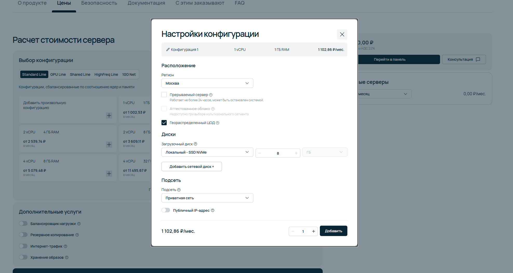

# Selectel

[Selectel](https://selectel.ru/) добавлен как отдельный провайдер для раздела хостингов. На 13 июля 2026 года заметка дополнена приложенными скриншотами панели и страниц VDS, ценами на VDS и облачные серверы, внешними отзывами, а также отдельной проверкой ограничений дешевой линейки VDS.

[Перейти на сайт Selectel](https://selectel.ru/?ref_code=9707fc77a7)

## Статус заметки

Личного теста VPS/VDS или облачного сервера Selectel в этой заметке пока нет. Selectel выглядит сильным российским вариантом за счет собственных дата-центров, облачной платформы, дешевой линейки VDS и большого числа внешних отзывов, но фиксированные VDS имеют существенные ограничения по сети, портам, дискам и резервному копированию. Для собственного почтового сервера эта линейка не подходит из-за неотключаемой блокировки исходящих SMTP-портов 25, 465 и 587. Перед переносом другого рабочего проекта все равно нужен практический тест по цене, панели, поддержке, сети и диску.

## Что известно

По официальным страницам Selectel предлагает облачные серверы, VPS/VDS, выделенные серверы, Kubernetes, базы данных, S3, CDN, GPU/AI-инфраструктуру, частное облако, colocation и сопутствующие корпоративные решения.

На странице облачных серверов указано, что серверы размещены в 3 регионах, 6 зонах доступности и 17 пулах в дата-центрах Selectel уровня Tier III.

Отдельно у Selectel есть геораспределенный регион `ru-6a`, `ru-6b`, `ru-6c` для отказоустойчивых схем.

## Скриншоты

На скриншоте создания нового VDS выбран регион Москва, образ Ubuntu 24.04 LTS 64-bit и минимальная конфигурация VDS-1: 1 vCPU, 1 ГБ RAM, 10 ГБ NVMe-диск, 200 ₽/мес. В списке также видны старшие готовые конфигурации до 8 vCPU, 16 ГБ RAM и 160 ГБ NVMe за 3000 ₽/мес.

На скриншоте публичной страницы цен VDS показана та же линейка из семи фиксированных конфигураций: от VDS 1-1-10 за 200 ₽/мес до VDS 8-16-160 за 3000 ₽/мес. Отдельная синяя карточка подсказывает, что для нестандартных конфигураций нужно смотреть облачные серверы.

На скриншоте калькулятора облачных серверов выбран вариант Standard Line: 1 vCPU, 1 ГБ RAM, локальный SSD NVMe 8 ГБ, регион Москва, включен геораспределенный ЦОД. Итог в модальном окне - 1102,86 ₽/мес. В фоне также видны стартовые карточки облачных серверов: 1 vCPU / 1 ГБ RAM от 1002,53 ₽/мес, 2 vCPU / 4 ГБ RAM от 2539,74 ₽/мес, 4 vCPU / 8 ГБ RAM от 5079,48 ₽/мес.

## Цены: VDS и облачные серверы

У Selectel важно не смешивать два продукта.

**VDS** - это готовые фиксированные конфигурации. В документации Selectel прямо указано, что VDS тарифицируется единой ценой за конфигурацию, а не отдельно по vCPU, RAM и диску. Произвольная настройка vCPU/RAM/диска недоступна: если нужна нестандартная конфигурация, нужно создавать облачный сервер.

На скриншотах и официальной странице VDS на 3 июля 2026 года видна такая сетка:

| Конфигурация | vCPU | RAM | NVMe-диск | Цена |
| --- | ---: | ---: | ---: | ---: |
| VDS 1-1-10 | 1 | 1 ГБ | 10 ГБ | 200 ₽/мес |
| VDS 1-2-25 | 1 | 2 ГБ | 25 ГБ | 250 ₽/мес |
| VDS 2-2-40 | 2 | 2 ГБ | 40 ГБ | 400 ₽/мес |
| VDS 2-4-50 | 2 | 4 ГБ | 50 ГБ | 650 ₽/мес |
| VDS 4-8-80 | 4 | 8 ГБ | 80 ГБ | 1100 ₽/мес |
| VDS 6-12-120 | 6 | 12 ГБ | 120 ГБ | 2000 ₽/мес |
| VDS 8-16-160 | 8 | 16 ГБ | 160 ГБ | 3000 ₽/мес |

По документации VDS работает на Intel Xeon Gold 6240R в Москве и Санкт-Петербурге, использует локальные NVMe SSD в RAID 10, а для VDS доступно 3 ТБ бесплатного внешнего трафика в месяц на аккаунт. Важная оговорка: при выключении VDS оплата продолжает начисляться, потому что ресурсы остаются зарезервированными.

**Облачные серверы** - это более гибкая и обычно более дорогая модель. Здесь цена складывается из ресурсов: vCPU, RAM, локальные и сетевые диски, публичные IP, GPU и дополнительные услуги. По документации облачных серверов используется pay-as-you-go: списание идет каждый час за предыдущий час потребления. Если облачный сервер выключен или приостановлен, vCPU, RAM, локальные и сетевые диски, GPU, публичные IP и подсети продолжают оплачиваться; при заморозке не тарифицируются vCPU, RAM и GPU, но остальные ресурсы оплачиваются.

По официальной странице цен для облачных серверов в московском пуле `ru-6a` на 3 июля 2026 года ориентиры такие:

| Ресурс облачного сервера | Цена в час | Цена в месяц |
| --- | ---: | ---: |
| vCPU, 1 ядро 2.25 ГГц | 1,0071 ₽ | 735,19 ₽ |
| RAM 2 133-2 933 МГц, 1 ГБ | 0,3662 ₽ | 267,34 ₽ |
| Локальный SSD NVMe, 1 ГБ | 0,0172 ₽ | 12,54 ₽ |
| Публичный IP-адрес | 0,2597 ₽ | 189,57 ₽ |
| Резервное копирование в облаке, 1 ГБ | 0,0062 ₽ | 4,50 ₽ |
| Сетевой базовый SSD-диск, 1 ГБ | 0,0138 ₽ | 10,09 ₽ |

На странице цен Selectel указано, что стоимость всех услуг приведена с учетом НДС 22%.

Практический вывод по цене простой: если подходит фиксированная сетка, VDS намного дешевле как входная точка. Если нужны нестандартные ресурсы, масштабирование, сетевые диски, GPU, балансировщики или более сложная облачная схема, нужно считать облачный сервер в калькуляторе и отдельно проверять публичный IP, бэкапы, трафик и платные дополнительные услуги.

## Ограничения линейки VDS

Дешевая линейка «VDS серверы» — не уменьшенная копия облачного сервера, а отдельный упрощенный продукт. Ограничения ниже относятся именно к VDS; у облачных и выделенных серверов Selectel возможности и правила разблокировки могут отличаться.

### SMTP и другие сетевые ограничения

Для VDS заблокирован исходящий TCP-трафик на порты 25, 465 и 587 в направлении публичных IPv4- и IPv6-адресов. Входящие соединения на эти SMTP-порты не блокируются, поэтому сервер технически может принимать почту, но не сможет напрямую доставлять ее на другие почтовые серверы через порт 25 и не сможет подключаться к обычному внешнему SMTP-релею через порты 465 или 587.

Разблокировать 25, 465 и 587 для IP-адресов VDS нельзя. Запрос на разблокировку, описанный в общей сетевой документации Selectel, применим к части других продуктов, но прямо исключает VDS. Selectel рекомендует использовать свой почтовый сервис. Альтернативой может быть внешний SMTP-релей с нестандартным портом, например 2525, если выбранный сервис его поддерживает.

Практический вывод: VDS Selectel не подходит для полноценного собственного почтового сервера и неудобен для приложений, которые умеют отправлять почту только через 25, 465 или 587. Для сайта или приложения отправку писем нужно заранее вынести во внешний сервис и проверить доступный порт.

В общем списке Selectel также заблокированы порты 17, 111, 135, 137, 138, 139, 389, 427, 445, 520, 1900, 3702 и 11211 по TCP и/или UDP. Документация продукта прямо указывает, что разблокировать порты для VDS нельзя. Кроме того, с VDS заблокирован доступ к публичным подсетям электронного правительства, включая портал Госуслуг и связанные сервисы; снять это ограничение для VDS тоже нельзя.

### Сеть, диски и восстановление

Другие ограничения VDS, явно указанные в документации Selectel:

- только один публичный IP-адрес из общего пула — нельзя выбрать конкретный адрес или подсеть, заменить адрес либо добавить дополнительные IP;
- нет приватных сетей, групп безопасности и балансировщиков нагрузки;
- доступны только локальные диски, подключить сетевой диск нельзя;
- диск, vCPU и RAM связаны фиксированной конфигурацией — отдельно увеличить диск нельзя, перейти на меньшую конфигурацию нельзя;
- автоматического резервного копирования VDS нет, копии нужно настраивать самостоятельно и хранить вне сервера;
- соответствие сервера требованиям 152-ФЗ для этой линейки не заявлено — для такой задачи Selectel направляет к облачным серверам;
- пропускная способность сети указана как «до 3 Гбит/с», а не как гарантированная скорость;
- 3 ТБ бесплатного внешнего трафика считаются суммарно на все проекты облачной платформы в одном аккаунте, превышение оплачивается отдельно;
- при выключении и даже блокировке VDS из-за нехватки средств оплата продолжает начисляться; если не погасить долг в течение 14 дней после блокировки, сервер и данные локального диска удаляются.

В итоге VDS разумно рассматривать для сайта, VPN, тестового окружения или небольшого приложения, которому достаточно одного публичного IP и локального диска. Для почтового сервера, сложной частной сети, нескольких IP, автоматических снапшотов и бэкапов, 152-ФЗ или гибкого масштабирования лучше сразу считать облачный сервер Selectel либо другого провайдера.

## Локации и ЦОД

По официальной странице дата-центров у Selectel есть 6 собственных дата-центров уровня Tier III в Москве и Санкт-Петербурге. На странице облака 152-ФЗ также указаны собственные дата-центры на территории РФ в Москве, Санкт-Петербурге и Ленинградской области, плюс партнерская площадка в Новосибирске.

Практический вывод: Selectel стоит рассматривать, когда нужна российская инфраструктура с несколькими зонами, а не одиночный дешевый VPS.

## Сертификация и безопасность

По официальным страницам Selectel:

- есть облачные серверы 152-ФЗ для хранения и обработки персональных данных;
- российские серверы в дата-центрах Selectel соответствуют требованиям 152-ФЗ и приказам ФСТЭК N 17 и N 21;
- для госучреждений указаны специальный сегмент ЦОД и публичное облако, аттестованные по требованиям ФСТЭК до К1, УЗ-1 и 1Г включительно;
- защита от DDoS на уровнях L3/L4 заявлена как включенная в стоимость продуктов.

Для реального проекта нужно проверять конкретную услугу, договор, зону ответственности и актуальные аттестаты. Как и у других облаков, часть требований остается на стороне клиента.

## Быстрая проверка

Проверка 11 июня 2026 года из текущей сети:

- `https://selectel.ru/services/cloud/servers/` открылся с HTTP 200 примерно за 2.0 секунды;
- `https://selectel.ru/services/cloud/servers/152fz/` открылся с HTTP 200 примерно за 0.5 секунды;
- `https://selectel.ru/about/data-centers/` открылся с HTTP 200 примерно за 0.5 секунды.

Это только проверка публичных страниц. Новый сервер не создавался.

## Внешние отзывы

Картина по отзывам неоднородная: у Selectel много положительных оценок на массовых площадках, но негативные отзывы достаточно конкретные, чтобы не переносить важный проект без теста и внешних бэкапов.

На Т-Банке у общей карточки `selectel` указаны 4,7 из 5 на основании 455 оценок и 125 текстовых отзывов. Чаще хвалят стабильность, удобный интерфейс, работу серверов, качество связи и поддержку. В минусах встречаются цена, сложность интерфейса, невозможность оплаты иностранными картами и ограничения по изменению диска.

Отдельная карточка `VDS Selectel` на Т-Банке показывает 4,6 из 5 на основании 30 оценок и 8 отзывов. Там хвалят дешевые VDS, поддержку и работу серверов, но несколько пользователей отдельно отмечают, что оплата идет не только пока сервер "работает", а также при выключении. Это совпадает с документацией Selectel: ресурсы VDS резервируются и продолжают тарифицироваться.

На Яндекс Картах у организации Selectel показаны 4,9 на основе 644 оценок и 172 отзывов. Свежая выдача там смешанная: рядом с положительными отзывами про понятный интерфейс, облачные серверы и поддержку есть жалобы на аварии, проблемы восстановления и длительные инциденты. Для оценки хостинга это полезный сигнал, но нужно помнить, что карточка Яндекса относится к компании в целом, а не только к VDS.

На Hosting101 по Selectel указаны 560 оценок. В преимуществах чаще отмечают быструю реакцию на тикеты, российскую локацию, качество поддержки, оплату по потреблению, удобную панель, заранее объявляемые работы и стабильность. В недостатках агрегатор выделяет нестабильность, регулярные падения, проблемы с сетью, поддержку и высокие цены. Такой разброс хорошо объясняет, почему Selectel нельзя оценивать только по среднему рейтингу.

На Hostings.info у Selectel указана пользовательская оценка 3,9, редакционная оценка 3,4, 34 отзыва и официальный представитель компании. Это более осторожный сигнал: провайдер крупный и живой, но претензии к цене, надежности и поддержке нужно проверять на своем сценарии.

## Плюсы

- Самостоятельный крупный российский инфраструктурный провайдер;
- есть собственные дата-центры уровня Tier III;
- есть несколько регионов и зон доступности для облачных серверов;
- есть отдельная дешевая линейка VDS от 200 ₽/мес;
- широкий набор IaaS/PaaS-сервисов, не только VPS;
- есть отдельные решения под 152-ФЗ и аттестованную инфраструктуру;
- заявлена DDoS-защита L3/L4;
- много внешних отзывов и оценок, по которым можно заранее собрать список рисков для теста.

## Минусы и риски

- Нет личного теста в этой заметке;
- облачные серверы могут быть заметно дороже и сложнее простых VPS/VDS-провайдеров;
- исходящие SMTP-порты 25, 465 и 587 для VDS заблокированы без возможности разблокировки — линейка не подходит для полноценного собственного почтового сервера;
- для VDS действуют и другие неотключаемые сетевые ограничения, включая ряд служебных портов и доступ к подсетям электронного правительства;
- доступен только один публичный IP: его нельзя выбрать, заменить или дополнить другими адресами;
- у VDS нет приватных сетей, групп безопасности и балансировщиков нагрузки;
- у VDS нельзя произвольно менять соотношение vCPU, RAM и диска, подключать сетевые диски или переходить на меньшую конфигурацию;
- автоматическое резервное копирование VDS отсутствует;
- соответствие 152-ФЗ относится не ко всем продуктам Selectel и для линейки VDS не заявлено;
- выключение VDS или облачного сервера само по себе не обнуляет оплату зарезервированных ресурсов;
- нужно проверять, какие именно документы и аттестаты относятся к выбранной услуге;
- для небольших проектов часть корпоративных возможностей может быть избыточной;
- во внешних отзывах есть жалобы на нестабильность, поддержку, аварии, восстановление данных и итоговую стоимость;
- нужно отдельно проверить поддержку, биллинг, ограничения портов, работу IP и условия восстановления.

## Что тестировать перед рекомендацией

- минимальный VPS или облачный сервер в нужном регионе;
- подходит ли один неизменяемый публичный IP и отсутствие приватных сетей;
- итоговую цену с диском, внешним бэкапом и трафиком сверх общего лимита 3 ТБ;
- что реально происходит с оплатой при выключении, блокировке и удалении ресурсов;
- пинг и скорость до целевой аудитории;
- качество диска и стабильность CPU под нагрузкой;
- работу панели, API и документации;
- поддержку по простому вопросу и по технической проблеме;
- доступность выбранного внешнего почтового сервиса через альтернативный порт, если приложению нужна отправка писем; PTR, антиабуз и DDoS.

## Итог

Selectel стоит держать в списке сильных российских вариантов, особенно когда нужны несколько зон, собственные ЦОД, 152-ФЗ, корпоративная инфраструктура или дальнейший рост за пределы одного VPS. Для простых веб-задач теперь есть понятная точка входа — фиксированные VDS от 200 ₽/мес. Но это не универсальный VPS: для почтового сервера VDS не подходит, а один неизменяемый публичный IP, отсутствие приватных сетей и автоматических бэкапов нужно учитывать до покупки.

Главная оговорка: VDS и облачные серверы у Selectel нужно считать отдельно. VDS дешевый и простой, но фиксированный и заметно урезанный по сети, дискам, резервному копированию и SMTP. Облачные серверы гибкие, но тарифицируются по ресурсам и могут быстро стать дороже, особенно с публичными IP, дисками, бэкапами и дополнительными сервисами. По отзывам провайдер выглядит сильным, но не беспроблемным, поэтому перед рекомендацией все равно нужен собственный тест.

## Связанные материалы

- [Инциденты и внешние тесты хостингов в 2026](../info/hosting-incidents-tests-2026.md)

## Источники

- [Selectel](https://selectel.ru/?ref_code=9707fc77a7)
- [Облачные серверы Selectel](https://selectel.ru/services/cloud/servers/)
- [VPS/VDS Selectel](https://selectel.ru/services/cloud/vps-vds/)
- [VPS/VDS с почасовой оплатой Selectel](https://selectel.ru/services/cloud/servers/vps-hour/)
- [Цены Selectel](https://selectel.ru/prices/)
- [Документация Selectel: модель оплаты и цены облачного сервера](https://docs.selectel.ru/cloud-servers/about/payment/)
- [Документация Selectel: описание и ограничения VDS серверов](https://docs.selectel.ru/vds-servers/about/about-vds-server/)
- [Документация Selectel: заблокированные порты и интернет-ресурсы](https://docs.selectel.ru/infrastructure/blocked-ports/)
- [Документация Selectel: модель оплаты и цены VDS сервера](https://docs.selectel.ru/vds-servers/about/payment/)
- [Документация Selectel: конфигурации VDS сервера](https://docs.selectel.ru/vds-servers/about/configurations/)
- [Облако 152-ФЗ Selectel](https://selectel.ru/services/cloud/servers/152fz/)
- [Дата-центры Selectel](https://selectel.ru/about/data-centers/)
- [Selectel для государственных учреждений](https://selectel.ru/solutions/government/)
- [Отзывы Selectel на Т-Банке](https://www.tbank.ru/reviews/company/selectel/10360/)
- [Отзывы VDS Selectel на Т-Банке](https://www.tbank.ru/reviews/company/vds-selectel/106047/)
- [Отзывы Selectel на Яндекс Картах](https://yandex.ru/maps/org/selectel/1225927544/reviews/)
- [Отзывы Selectel на Hosting101](https://hosting101.ru/selectel.ru)
- [Обзор Selectel на Hostings.info](https://ru.hostings.info/selectel-ru.html)
- Скриншоты страниц и панели Selectel от 3 июля 2026 года
