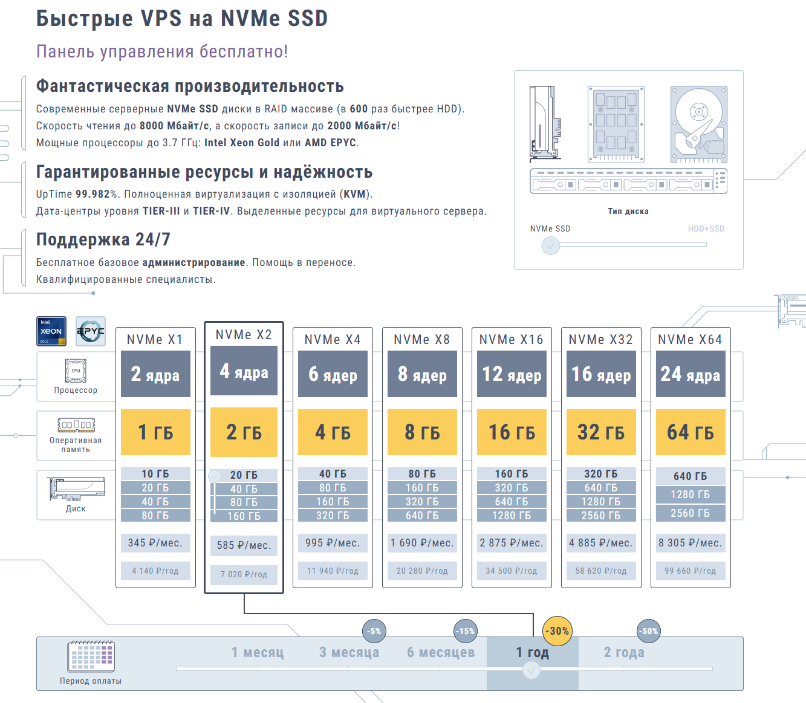
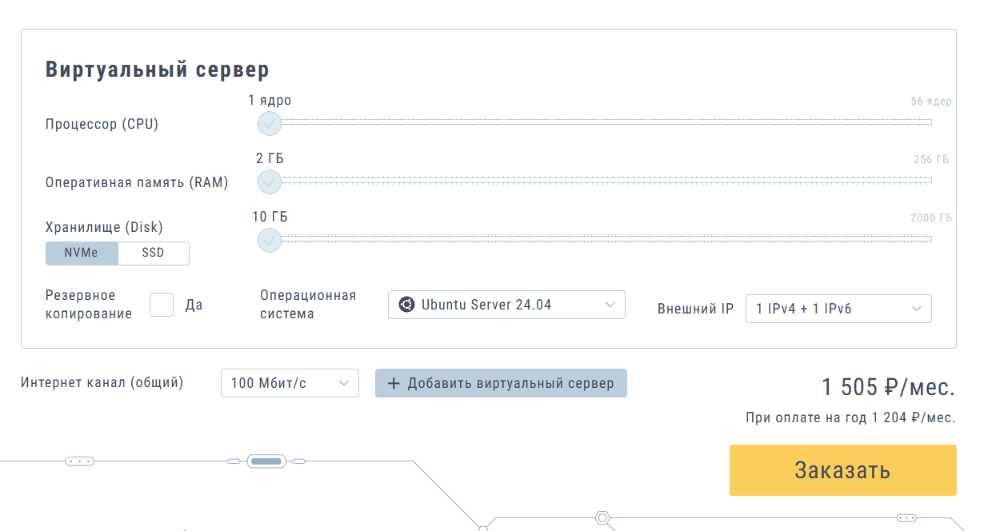
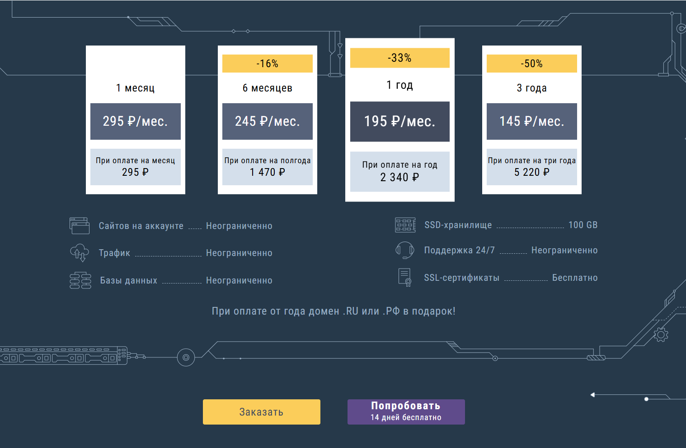
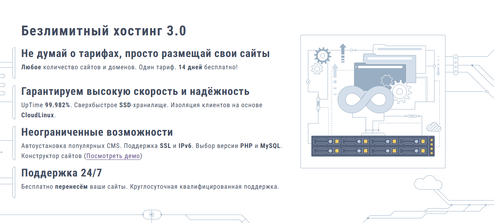

# SmartApe

[SmartApe](https://www.smartape.ru/) добавлен как кандидат на тест VPS и обычного хостинга. Личного теста сервера пока нет, поэтому это не рекомендация, а первичная карточка: публичные условия провайдера, приложенные скриншоты и внешние отзывы на 3 июля 2026 года.

## Что известно

SmartApe работает как российский хостинг-провайдер с 2012 года. В линейке есть безлимитный хостинг 3.0, Битрикс-хостинг, VPS на NVMe SSD, дешевые VPS на HDD + SSD, Windows VPS, выделенные серверы, colocation и облачный ЦОД.

На официальной странице быстрых VPS заявлены:

- NVMe SSD в RAID-массиве;
- KVM-виртуализация с выделенными ресурсами;
- процессоры Intel Xeon Gold или AMD EPYC;
- заявленный uptime 99.982%;
- дата-центры уровня Tier III и Tier IV;
- бесплатная панель управления;
- поддержка 24/7, базовое администрирование и помощь в переносе.

На странице дата-центров указаны площадки DataPro Moscow I, DataPro Moscow II, DataPro Moscow III, Host-Telecom в Чехии и Partner Group в Израиле. Для выбора VPS важно отдельно проверить, какие локации доступны именно в нужном тарифе и как они маршрутизируются до целевой аудитории.

## Скриншоты

На скриншоте быстрых VPS видна линейка NVMe X1-X64. При выбранной оплате за год и скидке 30% минимальный вариант NVMe X1 показан как 2 ядра, 1 ГБ RAM, 10 ГБ диска и 345 ₽/мес. Старшие варианты идут до NVMe X64: 24 ядра, 64 ГБ RAM и 640 ГБ диска в минимальном выборе.

В конфигураторе виртуального сервера на скриншоте выбран минимальный ручной сетап: 1 ядро, 2 ГБ RAM, 10 ГБ NVMe, Ubuntu Server 24.04, 100 Мбит/с и 1 IPv4 + 1 IPv6. Цена показана как 1505 ₽/мес или 1204 ₽/мес при оплате за год.

Для безлимитного хостинга 3.0 на скриншоте видны периоды оплаты: 295 ₽/мес за 1 месяц, 245 ₽/мес при оплате на 6 месяцев, 195 ₽/мес при оплате на год и 145 ₽/мес при оплате на 3 года. В карточке также указаны 100 ГБ SSD-хранилища, поддержка 24/7, бесплатные SSL-сертификаты, неограниченные сайты, трафик и базы данных.

Отдельный экран безлимитного хостинга обещает один тариф, 14 дней бесплатно, поддержку SSL и IPv6, выбор версии PHP и MySQL, автоустановку CMS и перенос сайтов.

## Важная оговорка про безлимит

Маркетинговый "безлимит" здесь нельзя читать буквально как бесконечный диск и любые нагрузки. В официальной справке SmartApe пишет, что безлимитный хостинг предназначен для ненагруженных сайтов, а место на диске составляет 100 ГБ. Там же отдельно указано, что хранить резервные копии и файлы, не относящиеся к сайту, запрещено.

Практический вывод: shared-хостинг можно рассматривать для сайтов-визиток, блогов, небольших магазинов и набора малонагруженных проектов. Для тяжелого файлового архива, бэкапов, высоконагруженного магазина или нестандартного сервиса лучше смотреть VPS и заранее уточнять правила использования.

## Внешние отзывы

Отзывы по SmartApe в основном положительные, но не однородные.

На Hosters у SmartApe указаны 79 отзывов, пользовательская оценка 4.65 из 5 и общий рейтинг 8.7 из 10. В свежих и старых отзывах часто хвалят цену, работу VPS, стабильность и поддержку. Это сильный сигнал в плюс, но он остается сигналом каталога отзывов, а не заменой собственного теста.

На Hostings.info у провайдера показаны пользовательская оценка 4.4, оценка редакции 4.4, официальный представитель компании, 108 отзывов и отметка "на рынке с 2012 года". Экспертный обзор отдельно выделяет привлекательные цены, скидки, бесплатный домен при долгой оплате и Битрикс-ориентацию.

На Hosting101 картина полезнее для разбора рисков. По общей странице хостинга за последние пять лет проголосовали 1112 человек: чаще всего в плюс отмечают безлимитность, поддержку, цену и скорость. По странице VPS проголосовали 100 человек: в плюс чаще отмечают цену, поддержку, KVM, DDoS-защиту и нетарифицируемый трафик. Но там же есть минусы: ограничение скорости 100 Мбит/с, поддержка через тикеты и почту, жалобы на непонятные ответы поддержки, удаление сервера и долгую реакцию.

TopHosts в обзоре тоже держит смешанную позицию: среди плюсов отмечает недорогую тарифную сетку, защиту данных, стабильность, поддержку и простое управление, а среди минусов - ограничения на безлимитном тарифе, не самую высокую скорость и возможные перегрузки серверов.

На Trustpilot для `smartape.net` выборка маленькая: всего 3 отзыва, TrustScore 2.8 из 5 и нет новых отзывов за последние 12 месяцев. Там есть негативные сообщения про остановку сайтов, удаление баз данных и реакцию поддержки. Это слабая по объему, но важная красная метка: перед переносом рабочих проектов нужно отдельно проверить бэкапы, правила блокировки и ответственность за данные.

## Плюсы

- есть недорогой shared-хостинг с длинными скидками;
- есть VPS на NVMe SSD и отдельная линейка HDD + SSD;
- заявлена KVM-виртуализация и выделенные ресурсы;
- на скриншоте минимальный NVMe X1 выглядит интересным по цене при оплате за год;
- есть Москва и зарубежные дата-центры в публичном списке площадок;
- есть 14-дневный пробный период для хостинга;
- много русскоязычных отзывов на нескольких площадках;
- официальная справка честно раскрывает часть ограничений "безлимита".

## Минусы и риски

- пока нет личного теста VPS;
- цена сильно зависит от выбранного срока оплаты и скидки;
- "безлимитный" хостинг фактически имеет диск 100 ГБ и ограничения по типу данных;
- в отзывах встречаются жалобы на тикетную поддержку, удаление сервера или данных и спорные реакции на проблемы;
- старые отзывы по VPS могут относиться к другой тарифной сетке и другой инфраструктуре;
- нужно отдельно проверить, какой порт и лимит реально выдаются на конкретном VPS;
- для рабочих проектов нельзя полагаться только на встроенные бэкапы провайдера.

## Что тестировать перед рекомендацией

- взять минимальный NVMe VPS на короткий срок или тестовый период, если он доступен;
- зафиксировать тариф, локацию, тип диска, канал, IPv4/IPv6 и итоговую цену продления;
- прогнать `iperf3`, `fio`, `sysbench`, ping и длительную передачу файлов;
- проверить скорость до российских операторов и нужных зарубежных направлений;
- проверить CPU steal и стабильность под нагрузкой 3-7 дней;
- уточнить у поддержки правила бэкапов, блокировок, жалоб, замены IP, SMTP и возврата средств;
- для shared-хостинга проверить реальный лимит inode, CPU, RAM, процессов, почты и баз данных;
- держать внешний бэкап до переноса любого рабочего сайта.

## Итог

SmartApe выглядит нормальным кандидатом на тест, особенно если нужен недорогой российский хостинг или VPS с рублевой оплатой и русскоязычной поддержкой. Самый интересный вход - проверить минимальный NVMe VPS и отдельно безлимитный хостинг 3.0 для малонагруженных сайтов.

Главная оговорка: это пока не рекомендация. Сначала нужен практический тест диска, сети, поддержки, бэкапов и правил блокировки. По отзывам провайдер выглядит живым и популярным, но негативные сигналы достаточно конкретные, чтобы не переносить важный проект без внешней резервной копии.

## Источники

- [SmartApe](https://www.smartape.ru/)
- [Быстрые VPS на NVMe SSD - SmartApe](https://www.smartape.ru/ssd-vps)
- [Безлимитный хостинг 3.0 - SmartApe](https://www.smartape.ru/neogranichennyj-hosting)
- [Дата-центры SmartApe](https://www.smartape.ru/data-centers)
- [Какой вид хостинга выбрать - SmartApe](https://www.smartape.ru/faq/what-type-of-hosting-to-choose)
- [Отзывы SmartApe на Hosters](https://hosters.ru/smartape/otzyvi.html)
- [Обзор SmartApe на Hostings.info](https://ru.hostings.info/smartape-ru.html)
- [Отзывы SmartApe на Hosting101](https://hosting101.ru/smartape.ru)
- [Отзывы VPS SmartApe на Hosting101](https://hosting101.ru/smartape.ru-vps)
- [Обзор и отзывы SmartApe на TopHosts](https://ru.tophosts.net/companies/smartape)
- [Trustpilot: smartape.net](https://www.trustpilot.com/review/smartape.net)
- Скриншоты страниц SmartApe от 3 июля 2026 года
