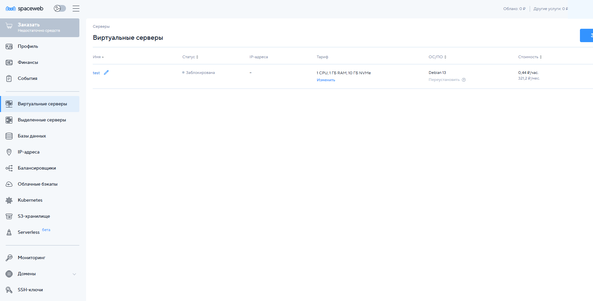
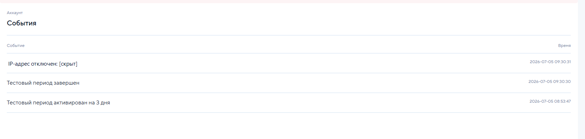
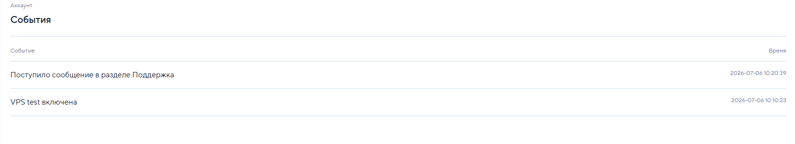
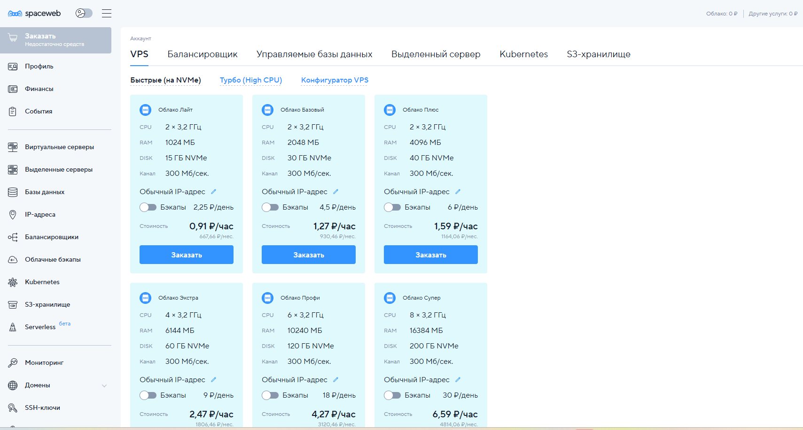
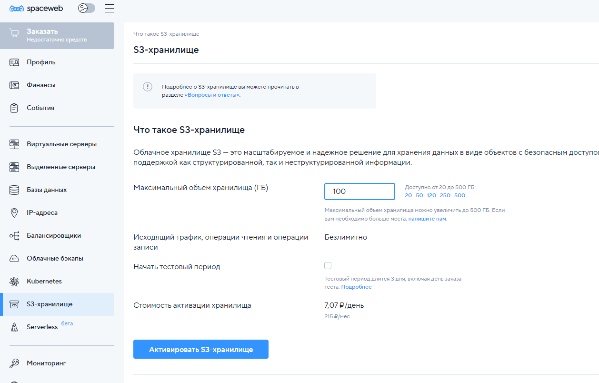

# SpaceWeb / Sweb

SpaceWeb, он же Sweb, стоит учитывать как старый рабочий хостинг с положительным историческим опытом. Свежий VPS-тест уже начат: 5 июля 2026 года тестовый VDS удалось активировать, но сервер почти сразу заблокировался; 6 июля поддержка ответила, что тестовый период активирован на 3 дня, после чего в событиях панели появилось повторное включение VPS и базовый тест Debian 13 прошел успешно.

[Перейти на сайт SpaceWeb](https://sweb.ru/?utm_term=apfuizec)

Партнерский промокод: `apfuizec`. Для новых клиентов по партнерской программе указана дополнительная скидка 15%, но за такого клиента начисляется только 50% партнерского вознаграждения.

## Что известно

SpaceWeb - старый российский хостинг-провайдер. На публичных страницах указаны виртуальный хостинг, VPS/VDS, облачные сервисы, выделенные серверы, домены, почта, SSL, защита от DDoS и готовые приложения для VPS.

На главной странице провайдер заявляет:

- работу с 2001 года;
- размещение в реестре провайдеров хостинга РФ;
- VPS/VDS от 277 рублей в месяц;
- root-доступ;
- бесплатную защиту от DDoS на всех тарифах VPS;
- поддержку 24/7;
- выделенные серверы от 7245 рублей в месяц.

На странице VPS 11 июня 2026 года видны стартовые тарифы:

- Cloud Promo: 1 CPU, 1 ГБ RAM, 10 ГБ NVMe, канал 300 Мбит/с, 277 рублей в месяц;
- Cloud Lite: 2 CPU, 1 ГБ RAM, 15 ГБ NVMe, канал 300 Мбит/с, 409 рублей в месяц;
- Cloud Base: 2 CPU, 2 ГБ RAM, 30 ГБ NVMe, канал 300 Мбит/с, 609 рублей в месяц.

Цены зависят от периода оплаты и акций, поэтому перед покупкой нужно проверять финальную сумму в корзине.

## Личный опыт

SpaceWeb использовался в двухтысячных, когда провайдер только открылся. Работа с ним длилась примерно 5-6 лет.

Сначала клиент выбрал SpaceWeb из-за конструктора сайтов и сам оплачивал услуги. Позже сайт был переделан на WordPress, но хостинг остался там же.

За весь период заметных проблем с хостингом не было. Работа прекратилась не из-за качества SpaceWeb, а потому что клиент обанкротился и проект закрылся.

## Локации

По справке SpaceWeb серверы размещаются в таких дата-центрах:

- Санкт-Петербург: "Дата-Центр №1";
- Москва: "Москва-II";
- Европа: EUnetworks, для зарубежных VPS.

На странице зарубежных VPS основной публичный акцент сделан на Нидерланды. Там же указаны тарифы NL и оплата в рублях.

## Тестовый период

У SpaceWeb есть акция с бесплатным тестовым периодом на VPS и S3 до 31 января 2027 года. Для участия нужно выбрать тариф, зарегистрироваться, подтвердить номер телефона и активировать тест в панели.

Важные ограничения теста:

- для VPS на тестовом периоде недоступен SMTP;
- канал на тесте ограничен до 10 Мбит/с;
- данные VDS и S3 после теста хранятся 7 дней.

## Тест VPS 5-6 июля 2026

5 июля 2026 года был активирован тестовый VDS с Debian 13. В панели сервер отображался как `test`: 1 CPU, 1 ГБ RAM, 10 ГБ NVMe, стоимость 0,44 ₽/час или 321,2 ₽/мес. Почти сразу после активации статус стал **"Заблокирована"**, IP-адрес в событиях был отключен.

В журнале событий видно, что тестовый период был активирован на 3 дня в 08:53:47, завершен в 09:30:30, а IP-адрес отключен в 09:30:31. Сам IP на скриншоте скрыт.

После блокировки была создана заявка в поддержку с вопросом: "Я активировал тестовый период VDS, но VDS сразу почти заблокировалась. В чем проблема?" Заявка получила статус **"В работе"**. Первый ответ поддержки пришел 5 июля в 11:42:53: обращение приняли и передали в работу, ответ обещали в течение рабочего дня в этой же заявке. В ответе также был указан график поддержки: с 10 до 19 часов по будним дням.

6 июля в 10:12:57 поддержка дала ответ по существу: тестовый период активирован на 3 дня. Личные данные, номер заявки, email и имена сотрудников в статье не публикуются. В событиях панели после ответа видны две записи: **"VPS test включена"** в 10:10:23 и сообщение в разделе поддержки в 10:20:39.

Практический вывод по обращению: тестовый период действительно можно включить в панели, но первая попытка закончилась автоматической блокировкой. Поддержка после обращения повторно включила тест, при этом причина первичной блокировки из ответа не ясна.

После повторного включения 6 июля 2026 года был запущен базовый скрипт тестирования VPS. Публичные IPv4/IPv6 адреса и hostname в статье не публикуются.

В панели у тестового VPS были указаны такие характеристики:

| Параметр панели | Значение |
| --- | --- |
| Тариф | Облако Промо |
| Конфигурация | 1 CPU, 1 ГБ RAM, 10 ГБ NVMe |
| Дата-центр | Санкт-Петербург |
| IP-адрес | назначен, точный адрес не публикуется |
| MAC-адрес | указан в панели, в статье не публикуется |
| Дополнительные IP | есть отдельный раздел для подключения |
| Локальная сеть | не подключена |
| Доступ | пароль, можно изменить в панели |
| ОС | Debian 13 |
| ПО | без ПО |

Тестовая конфигурация:

| Параметр | Значение |
| --- | --- |
| ОС | Debian GNU/Linux 13 (trixie) |
| Ядро во время теста | 6.12.94+deb13-cloud-amd64 |
| CPU | 1 vCPU, Intel Xeon Processor (Icelake), KVM |
| RAM | 996 MiB, без swap |
| Диск | 10 ГБ, ext4, около 8.4 ГБ свободно после установки пакетов |
| Сеть | IPv4 и IPv6 /64 назначены, IPv6-маршрут есть |
| Длительность длинных тестов | 30 секунд |
| fio | `libaio`, файл 4 ГБ, `direct=1` |

Быстрый iperf3-тест по российским серверам `itdoginfo` показал такие ориентиры:

| Сервер | Download | Upload | Ping |
| --- | ---: | ---: | ---: |
| Москва | 372.7 Мбит/с | 452.0 Мбит/с | 15 мс |
| Санкт-Петербург | 395.3 Мбит/с | 476.4 Мбит/с | 4 мс |
| Нижний Новгород | 401.2 Мбит/с | 481.3 Мбит/с | 17 мс |
| Челябинск | 400.6 Мбит/с | 567.2 Мбит/с | 39 мс |
| Тюмень | 346.7 Мбит/с | 475.1 Мбит/с | 50 мс |

Ручные 30-секундные iperf3-тесты с 5 параллельными потоками были ниже, но стабильнее как практический ориентир:

| Направление | Upload | Download |
| --- | ---: | ---: |
| Москва | 307 Мбит/с | 231 Мбит/с |
| Нижний Новгород | 307 Мбит/с | 244 Мбит/с |
| Тюмень | 305 Мбит/с | 236 Мбит/с |
| Нидерланды, Serverius | 300 Мбит/с | 158 Мбит/с |
| Париж | тест фактически не прошел | тест фактически не прошел |
| США, California | сервер iperf был занят | сервер iperf был занят |

Ping без потерь: Cloudflare IPv4 - в среднем 10.2 мс, `ya.ru` по IPv4 - 13.4 мс, московский MTS - 17.9 мс. IPv6 тоже заработал: Cloudflare IPv6 - 12.8 мс в среднем, `ya.ru` по IPv6 - 14.6 мс, потерь не было. Важная мелочь: публичный IPv6 lookup в скрипте вернул пустую строку, но адрес, маршрут, ping и mtr по IPv6 работали.

Результаты fio:

| Тест | Результат |
| --- | ---: |
| Sequential write, 1M, iodepth 16 | 1026 MiB/s |
| Sequential read, 1M, iodepth 16 | 17.4 GiB/s |
| Random read 4K, 70/30, iodepth 32 | 69.3k IOPS, 271 MiB/s |
| Random write 4K, 70/30, iodepth 32 | 29.7k IOPS, 116 MiB/s |

Sequential read выглядит слишком высоким для маленького 4 ГБ файла и короткого 30-секундного прогона, поэтому его лучше воспринимать осторожно: результат может быть усилен кэшем хоста. Запись и random read/write выглядят более полезными для практической оценки.

CPU и память:

| Тест | Результат |
| --- | ---: |
| sysbench CPU, 1 поток | 827.56 events/sec |
| sysbench CPU, повтор | 823.46 events/sec |
| sysbench memory write | 4060.81 MiB/s |

После повторного включения базовый тест выглядит нормально: сеть работает заметно выше заявленного ограничения тестового периода в 10 Мбит/с, IPv6 живой, диск быстрый, CPU для 1 vCPU ожидаемый. Но это пока короткий синтетический прогон на тестовом VDS, а не проверка стабильности 3-7 дней.

В той же панели видны быстрые VPS на NVMe с каналом 300 Мбит/с: от варианта с 2 CPU, 1 ГБ RAM и 15 ГБ NVMe за 0,91 ₽/час или 667,66 ₽/мес до варианта с 8 CPU, 16 ГБ RAM и 200 ГБ NVMe за 6,59 ₽/час или 4814,06 ₽/мес.

Отдельно в панели есть тестовый период для S3-хранилища. На скриншоте выбран максимальный объем 100 ГБ, исходящий трафик и операции чтения/записи обозначены как безлимитные, стоимость активации показана как 7,07 ₽/день или 215 ₽/мес.

## Сетевые решения

У SpaceWeb есть готовые сетевые решения для VPS. При этом на страницах таких решений есть формулировка, что они не предназначены для организации доступа к ресурсам и сетям, доступ к которым ограничен на территории РФ.

Для обычных корпоративных приватных сетей это может быть нормально, но для задач обхода блокировок условия нужно читать особенно внимательно.

## Быстрая проверка

Проверка 11 июня 2026 года из текущей сети:

- `https://sweb.ru/vds/` открылся с HTTP 200 примерно за 2.1 секунды;
- `https://sweb.ru/vds/abroad/` открылся с HTTP 200 примерно за 1.2 секунды;
- `https://help.sweb.ru/gde-fizicheski-nahodyatsya-servery_52.html` открылся с HTTP 200 примерно за 1.3 секунды;
- DNS в текущей среде отдает reserved/private адреса `198.18.*` и `fc00::*`, поэтому по этой проверке нельзя честно оценить реальный IP, ASN и географию.

Это была только проверка публичных страниц. Позже, 5 июля 2026 года, был активирован тестовый VDS, а 6 июля после обращения в поддержку удалось провести базовые тесты CPU, диска, IPv4/IPv6 и сети.

## Плюсы

- Старый российский провайдер, работает с 2001 года;
- есть положительный личный опыт 5-6 лет эксплуатации обычного хостинга без заметных проблем;
- есть VPS, виртуальный хостинг, выделенные серверы, домены и облачные сервисы;
- есть российские локации и зарубежные VPS в Европе;
- можно платить за зарубежный VPS в рублях;
- есть 3-дневный тестовый период;
- после повторного включения тестового VDS базовые тесты CPU, диска, IPv4/IPv6 и сети прошли успешно;
- есть DDoS-защита и готовые сетевые образы;
- панель и поддержка русскоязычные.

## Минусы и риски

- Личный опыт старый и относится к обычному хостингу, а не к свежим VPS/VDS тарифам;
- в условиях тестового периода указан канал до 10 Мбит/с и отсутствие SMTP, хотя фактический iperf3 после повторного включения VPS показал сотни Мбит/с;
- при попытке теста 5 июля 2026 года VDS почти сразу получил статус "Заблокирована"; 6 июля поддержка повторно включила тест, но причина первичной блокировки из ответа не ясна;
- для сетевых задач есть важная оговорка про недопустимость доступа к ограниченным в РФ ресурсам;
- цены на страницах могут отличаться из-за акций и периода оплаты;
- нужно отдельно проверять, какие тарифы доступны в Нидерландах и российских локациях на момент заказа.

## Что тестировать перед рекомендацией

- реальную скорость VPS в РФ и Нидерландах, не только Speedtest;
- пинг до России, Европы и нужных сетей;
- стабильность 3-7 дней под постоянной нагрузкой;
- работу портов, SMTP, PTR, антиабуз и правила по туннелям и прокси;
- качество поддержки: скорость ответа в чате, тикете и после создания VPS;
- условия возврата, продления и перехода с тестового периода на платный.

## Итог

SpaceWeb выглядит как понятный рабочий вариант для обычных сайтов и CMS: исторический опыт 5-6 лет был без заметных проблем. Для небольших VPS и зарубежной VPS-локации в Нидерландах с оплатой в рублях это уже не просто кандидат: базовый тест Debian 13 после повторного включения VDS прошел нормально. Главная оговорка - первичная автоматическая блокировка тестового VDS и отсутствие объяснения причины в ответе поддержки; финальный вывод по VPS лучше делать после проверки стабильности несколько дней.

## Источники

- [SpaceWeb](https://sweb.ru/?utm_term=apfuizec)
- [VPS/VDS SpaceWeb](https://sweb.ru/vds/)
- [Зарубежные VPS SpaceWeb](https://sweb.ru/vds/abroad/)
- [Где физически находятся серверы SpaceWeb](https://help.sweb.ru/gde-fizicheski-nahodyatsya-servery_52.html)
- [Тестовый период VPS и S3 SpaceWeb](https://sweb.ru/web/testvps/)
- [WireGuard на VPS SpaceWeb](https://sweb.ru/vds/wireguard/)
- [Промокод SpaceWeb](https://help.sweb.ru/entry/169/)
- [Реферальная программа SpaceWeb](https://help.sweb.ru/entry/1231/)
- [Дополнительная скидка SpaceWeb](https://sweb.ru/web/MarginSharing)
