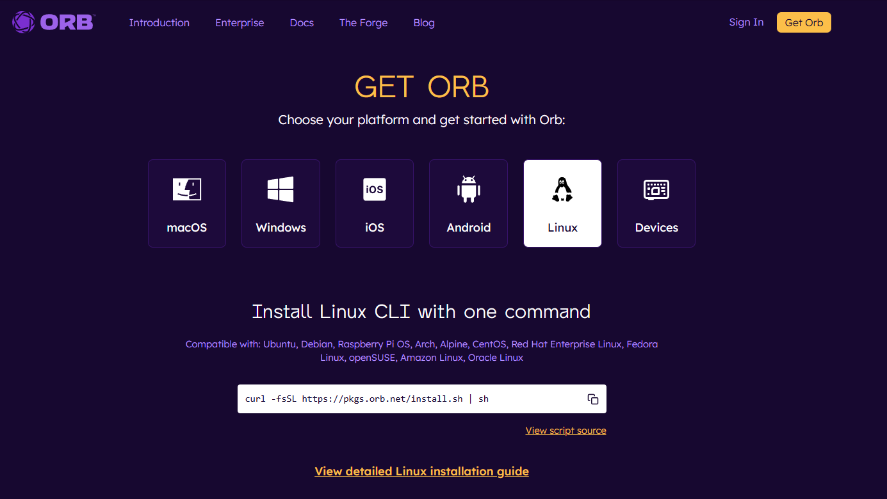

# Инструменты проверки скорости интернета

Проверка скорости интернета - важная задача для каждого пользователя. Хотя Speedtest.net от Ookla является самым популярным сервисом, существуют и другие качественные альтернативы. Ниже представлены лучшие аналоги:

## OpenSpeedTest

[OpenSpeedTest](https://openspeedtest.com/) - самый точный аналог Speedtest.net, работающий в браузере на любом устройстве. Сервис полностью бесплатный и не требует установки дополнительного ПО. Он измеряет скорость загрузки и отдачи, задержку (ping) и предоставляет подробную статистику.

## 2ip Speed Test

[2ip Speed Test](https://2ip.ru/speed/) - российская альтернатива Speedtest от разработчиков популярного сервиса 2ip.ru. Полнофункциональный инструмент, который позволяет проверить скорость интернета, пинг и другие параметры соединения. Интерфейс интуитивно понятен и локализован на русский язык.

## Speedof.me

[Speedof](https://speedof.me/) - мощный инструмент для проверки скорости интернета с дополнительными функциями. Помимо измерения скорости загрузки и отдачи, сервис показывает график потерь пакетов и отображает ваш IP-адрес. Особенно полезен для технической диагностики соединения.

## Cloudflare Speed Test

[Speed Test by Cloudflare](https://speed.cloudflare.com/) - инструмент от известной CDN-компании. Измеряет скорость интернета, задержку и определяет ваше географическое местоположение. Отличается высокой точностью благодаря глобальной инфраструктуре Cloudflare.

## Fast.com

[Fast](https://fast.com/) - удобный сервис от Netflix для мгновенной проверки скорости интернета прямо в браузере. Показывает только основные параметры (скорость загрузки), но делает это очень быстро и без рекламы. Минималистичный интерфейс подходит для быстрой проверки.

## Orb

[Orb](https://orb.net/get-orb/windows) - приложение от бывших разработчиков Speedtest. Доступно для всех популярных платформ (Windows, macOS, Android, iOS). Предоставляет подробную статистику и позволяет сохранять результаты тестов для последующего анализа.

## Яндекс.Интернетометр

[Яндекс.Интернетометр](https://internet.yandex.ru/) - российский сервис от Яндекса. Позволяет проверить скорость входящего и исходящего соединения. Входящее соединение влияет на скорость открытия сайтов и скачивания файлов, а исходящее используется при передаче данных с вашего компьютера в сеть (например, при отправке писем или загрузке фотографий в облако).

## Зачем использовать разные инструменты

Разные сервисы могут показывать различные результаты из-за:
- Различных серверов тестирования
- Различных методик измерения
- Нагрузки на сервера
- Географического расположения серверов

Рекомендуется использовать несколько инструментов для получения более точной картины скорости вашего интернет-соединения.